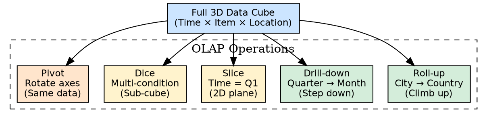
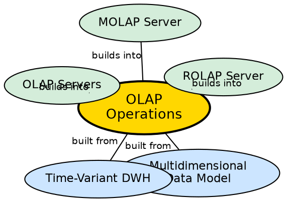

## The Problem

A 3D or 4D data cube contains millions of cells of multidimensional data. A manager does not want to see the entire cube — they want specific views: "Show me Q1 sales only" (filter), "Show me sales by country instead of city" (aggregate), "Show me monthly breakdown instead of quarterly" (detail), "Swap rows and columns to see patterns from a different angle" (rearrange). Without standardized operations, each of these would require custom SQL queries.

## Core Idea

**OLAP Operations** are five standard analytical functions that dynamically manipulate a multidimensional data cube: **Roll-up** (aggregate by climbing a hierarchy), **Drill-down** (detail by descending a hierarchy), **Slice** (filter on one dimension), **Dice** (filter on multiple dimensions), and **Pivot** (rotate axes for alternative views).

## How It Works

1. **Roll-up (Aggregation / Consolidation):**
   - **Mechanism:** Climbs **up** a concept hierarchy for a dimension, or removes a dimension entirely.
   - **Example:** City-level data (Vancouver, Toronto, Chicago, New York) → Country-level data (Canada, USA).
   - **Result:** Less detail, more summary. Dimension count may decrease.
   - **Hierarchy:** Street → City → Province → Country (climbing upward).

2. **Drill-down (Detailing):**
   - **Mechanism:** Steps **down** a concept hierarchy, or introduces a new dimension.
   - **Example:** Quarter-level data (Q1) → Month-level data (Jan, Feb, Mar).
   - **Result:** More detail, less summary. Dimension count may increase.
   - **Hierarchy:** Day → Month → Quarter → Year (stepping downward).

3. **Slice:**
   - **Mechanism:** Selects one particular dimension value, producing a 2D sub-cube from a 3D cube.
   - **Example:** `Time = "Q1"` — extracts the Q1 slice from the full cube.
   - **Result:** A 2D plane (single condition filter).

4. **Dice:**
   - **Mechanism:** Selects values across two or more dimensions, producing a smaller 3D sub-cube.
   - **Example:** `(Location = "Toronto" OR "Vancouver") AND (Time = "Q1" OR "Q2") AND (Item = "Mobile" OR "Modem")`.
   - **Result:** A smaller 3D box (multi-condition filter).

5. **Pivot (Rotate):**
   - **Mechanism:** Rotates the data axes — rows become columns, columns become rows.
   - **Example:** Swap "Item" from rows to columns axis.
   - **Result:** Same data, different visual presentation. No data is summarized or filtered.

## Visual Explanation

## Semantic Network

## Key Properties

- **Five operations:** Roll-up, Drill-down, Slice, Dice, Pivot
- **Hierarchy-driven:** Roll-up and Drill-down operate on concept hierarchies
- **Interactive:** Managers can explore data dynamically without writing SQL
- **Pre-computed speed:** Roll-ups are often pre-computed for millisecond response
- **Complementary:** Operations can be chained (slice → roll-up → pivot)

## Connections

- **Built from:** [[multidimensional-data-model|Multidimensional Data Model]] — operations manipulate the data cube
- **Built from:** [[time-variant-dwh|Time-Variant DWH]] — time hierarchies enable roll-up and drill-down
- **Builds into:** [[olap-servers|OLAP Servers]] — servers implement these operations
- **Builds into:** [[rolap-server|ROLAP Server]] — ROLAP implements operations via SQL
- **Builds into:** [[molap-server|MOLAP Server]] — MOLAP implements operations on pre-computed cubes
- **Related:** [[wiki/data-warehouse/fact-table|Fact Table]] — facts are the values that operations aggregate and filter

## Edge Cases & Gotchas

- **Roll-up ≠ Sum:** Roll-up can use different aggregation functions — SUM, AVG, COUNT, MIN, MAX — depending on the measure type.
- **Slice vs. Dice distinction:** Slice = one dimension, one condition (2D result). Dice = multiple dimensions, multiple conditions (3D sub-cube result).
- **Pivot does not change data:** Pivoting only rearranges the visual presentation. The underlying data values are unchanged.
- **Drill-down requires detail:** You can only drill down if the warehouse stores data at the lower granularity level.

## Sources

- [[dw1-summary|Source: Data Warehouse — Definitions, Architecture, ETL, OLAP]] — five OLAP operations, concept hierarchies
