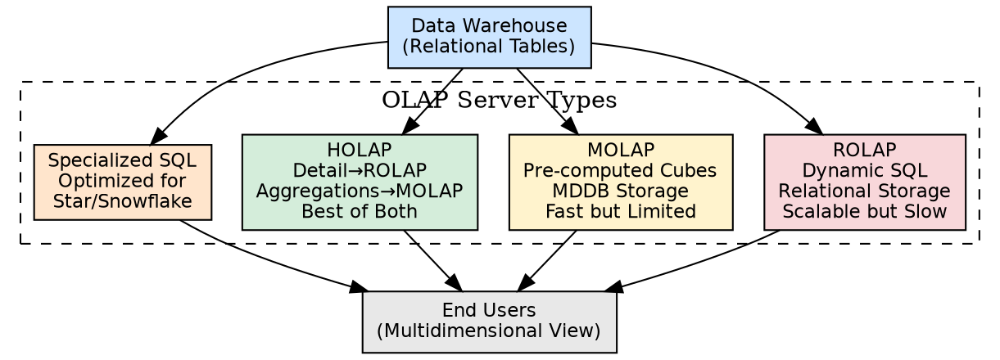
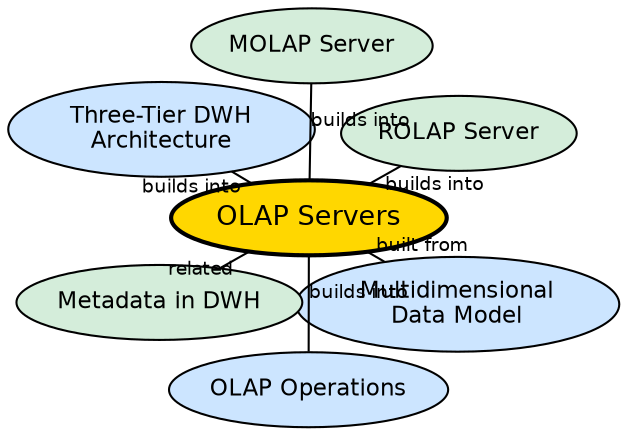

## The Problem

The multidimensional data model defines how data should be organized conceptually, but it does not specify how to physically store and process it. Should the data stay in relational tables and be converted to cubes on-the-fly? Should it be pre-calculated into proprietary multidimensional arrays? Should both approaches be combined? The choice of OLAP server architecture determines query speed, scalability, storage cost, and vendor dependency.

## Core Idea

**OLAP Servers** are the middle-tier engines that provide multidimensional views of warehouse data to end users. There are four types: **ROLAP** (uses relational tables, dynamically creates cubes via SQL), **MOLAP** (stores pre-calculated data in proprietary multidimensional arrays), **HOLAP** (combines ROLAP scalability with MOLAP speed), and **Specialized SQL Servers** (optimized SQL engines for star/snowflake schemas).

## How It Works

### 1. ROLAP (Relational OLAP)
- **Storage:** Data stays in standard relational tables (rows and columns).
- **Processing:** When a user requests a multidimensional view, the ROLAP engine generates complex SQL queries against the main warehouse and dynamically creates the cube.
- **Metadata layer:** A semantic layer of metadata maps dimensions to relational tables and supports aggregation definitions.
- **Strengths:** Handles large data volumes efficiently; integrates with existing RDBMS.
- **Weaknesses:** Slow response time (dynamic SQL generation and execution); scalability limitations for very complex queries.

### 2. MOLAP (Multidimensional OLAP)
- **Storage:** Data is pre-calculated and stored in proprietary **MDDBs** (Multidimensional Databases) — large arrays of data cubes.
- **Processing:** The MOLAP engine resides in the application layer and serves pre-computed cube data directly to users. No SQL generation needed.
- **Sparse matrix technology:** Manages data sparsity (empty cells) efficiently.
- **Strengths:** Lightning-fast response (data already calculated); simple interface for all user skill levels.
- **Weaknesses:** Limited data volumes (cannot store detailed data); storage waste with sparse datasets; proprietary vendor lock-in.

### 3. HOLAP (Hybrid OLAP)
- **Storage:** Detailed data stored in ROLAP (relational tables); aggregations stored in MOLAP (pre-calculated cubes).
- **Processing:** Queries for summaries hit the fast MOLAP store; queries for detail go to the ROLAP store.
- **Strengths:** Best of both worlds — ROLAP scalability + MOLAP speed.

### 4. Specialized SQL Servers
- **Purpose:** Provide advanced query language and processing support for SQL queries over star and snowflake schemas in read-only environments.
- **Optimization:** Query optimizer understands dimensional schema patterns and generates efficient execution plans.

## Visual Explanation

## Semantic Network

## Key Properties

- **Four types:** ROLAP (relational), MOLAP (multidimensional), HOLAP (hybrid), Specialized SQL
- **Speed vs. scale trade-off:** MOLAP is fast but limited; ROLAP is scalable but slow
- **Pre-computation:** MOLAP pre-calculates cubes; ROLAP computes on demand
- **Metadata dependency:** ROLAP requires a metadata layer to map dimensions to tables
- **Storage patterns:** ROLAP uses relational tables; MOLAP uses sparse matrix arrays

## Connections

- **Built from:** [[multidimensional-data-model|Multidimensional Data Model]] — servers implement the model
- **Built from:** [[three-tier-dwh-architecture|Three-Tier DWH Architecture]] — OLAP servers are Tier 2
- **Builds into:** [[olap-operations|OLAP Operations]] — servers execute these operations
- **Builds into:** [[rolap-server|ROLAP Server]] — one of the four server types
- **Builds into:** [[molap-server|MOLAP Server]] — one of the four server types
- **Related:** [[metadata-in-dwh|Metadata in DWH]] — ROLAP uses metadata for dimension mapping

## Edge Cases & Gotchas

- **HOLAP is not automatic:** Administrators must explicitly configure which aggregations go to MOLAP and which detail stays in ROLAP.
- **MOLAP vendor lock-in:** MDDBs are proprietary — migrating from one MOLAP vendor to another requires rebuilding all cubes.
- **ROLAP SQL complexity:** For complex roll-ups across many dimensions, ROLAP generates extremely complex SQL that may not execute efficiently.
- **Specialized SQL servers are niche:** Products like columnar databases (e.g., Redshift, BigQuery) are modern equivalents of specialized SQL servers.