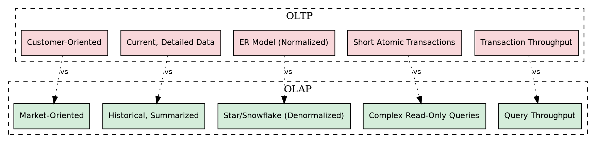
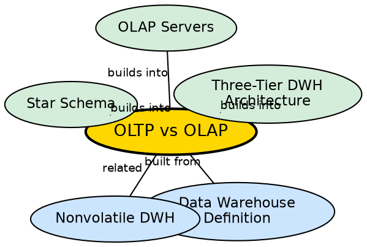

## The Problem

A single database cannot efficiently serve both transaction processing (fast, short, concurrent writes) and analytical processing (long, complex, aggregating reads). Running a 10-year revenue trend analysis on the same database that handles ATM transactions will either hang the analysis or slow down the ATM. The requirements are fundamentally opposite — one optimizes for throughput, the other for query depth.

## Core Idea

**OLTP (Online Transaction Processing)** and **OLAP (Online Analytical Processing)** represent two fundamentally different database paradigms. OLTP is customer-oriented, handles current detailed data, uses ER models, and requires concurrency control. OLAP is market-oriented, manages large amounts of historical data, uses star/snowflake schemas, and is mostly read-only. They serve different users, different purposes, and different access patterns.

## How It Works

The distinction manifests across five critical dimensions:

1. **User Orientation:**
   - **OLTP:** Customer-oriented. Used by clerks, DBAs, and IT professionals for daily operations (e.g., balance check, order entry).
   - **OLAP:** Market-oriented. Used by knowledge workers (managers, executives, analysts) for strategic analysis.

2. **Data Content:**
   - **OLTP:** Current, up-to-date, highly detailed data. Every individual transaction is recorded.
   - **OLAP:** Historical (5-10 years), summarized, multidimensional data at multiple granularity levels.

3. **Database Design:**
   - **OLTP:** Entity-Relationship (ER) model, application-oriented, normalized to minimize redundancy.
   - **OLAP:** Star or Snowflake schema, subject-oriented, denormalized for query speed.

4. **Access Patterns:**
   - **OLTP:** Short, atomic transactions (INSERT, UPDATE, DELETE, simple SELECT). Thousands of concurrent users. Requires concurrency control and recovery.
   - **OLAP:** Complex, long-running read-only queries. Hundreds of concurrent users. No concurrency control needed.

5. **Performance Metrics:**
   - **OLTP:** Measured by transaction throughput (transactions per second).
   - **OLAP:** Measured by query throughput (complex reports processed per unit time).

## Visual Explanation

## Semantic Network

## Key Properties

- **Opposite design goals:** OLTP optimizes for write speed and data integrity; OLAP optimizes for read speed and analytical depth
- **Different user bases:** Clerks/DBAs vs. managers/analysts
- **Different data lifetimes:** Current state vs. 5-10 year history
- **Different schemas:** ER/normalized vs. star/snowflake/denormalized
- **Different concurrency:** Thousands of concurrent writes vs. hundreds of concurrent reads
- **Complementary, not competing:** OLAP systems are fed by OLTP systems through ETL

## Connections

- **Built from:** [[data-warehouse-definition|Data Warehouse Definition]] — the fundamental reason warehouses exist is the OLTP/OLAP split
- **Built from:** [[nonvolatile-dwh|Nonvolatile]] — OLAP's read-only nature stems from nonvolatility
- **Builds into:** [[wiki/data-warehouse/star-schema|Star Schema]] — OLAP uses star/snowflake schemas
- **Builds into:** [[three-tier-dwh-architecture|Three-Tier DWH Architecture]] — the architecture separates OLTP sources from OLAP processing
- **Builds into:** [[olap-servers|OLAP Servers]] — OLAP servers implement the analytical processing paradigm
- **Contrasts with:** [[subject-oriented-dwh|Subject-Oriented DWH]] — OLTP is application-oriented, OLAP is subject-oriented

## Edge Cases & Gotchas

- **HTAP (Hybrid Transaction/Analytical Processing):** Newer systems like SAP HANA claim to handle both OLTP and OLAP in one database. These are exceptions that require specialized in-memory architectures.
- **Don't run OLAP queries on OLTP:** This is the most common mistake — a single complex analytical query can lock tables and bring down a production system.
- **Data staleness is expected:** OLAP data is never real-time; it reflects the last ETL cycle. This is by design, not a bug.
- **The same data, different structure:** OLAP data originates from OLTP — it's the same underlying business data, just restructured for analysis.

## Sources

- [[dw1-summary|Source: Data Warehouse — Definitions, Architecture, ETL, OLAP]] — 5-point comparison, application areas, memory formula
