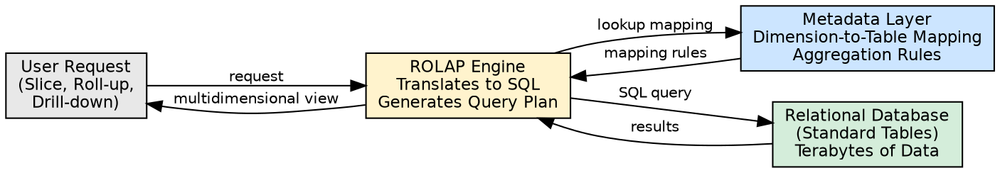
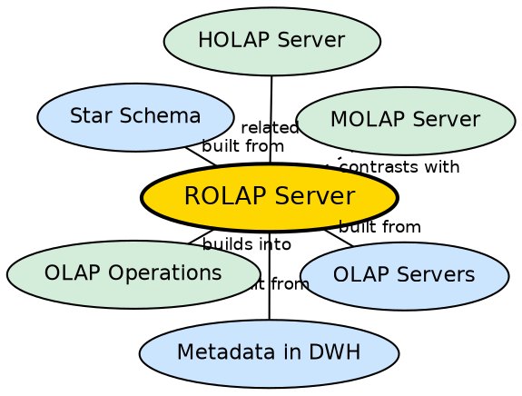

## The Problem

A company has an existing relational database with terabytes of warehouse data. Buying a proprietary multidimensional database (MDDB) for MOLAP would be expensive and would limit the data volume that can be analyzed. The company needs to provide multidimensional analytical views using the relational data it already has.

## Core Idea

**ROLAP (Relational Online Analytical Processing)** stores data in standard relational tables (rows and columns) and provides a multidimensional view to users by dynamically generating complex SQL queries. A metadata layer maps dimensions to relational tables, enabling users to interact with relational data as if it were a cube — without requiring proprietary storage.

## How It Works

1. **Data remains relational:** The warehouse data stays in its existing relational format — no conversion to multidimensional arrays.
2. **Semantic metadata layer:** A metadata layer is created that maps dimension concepts (Time, Item, Location) to the underlying relational tables and columns. This layer also defines aggregation rules.
3. **Dynamic query generation:** When a user requests a multidimensional view (e.g., "sales by city and quarter"), the ROLAP engine:
   - Translates the request into complex SQL queries with JOINs, GROUP BYs, and aggregate functions.
   - Executes the queries against the main warehouse.
   - Returns results formatted as a multidimensional view.
4. **Aggregation support:** The metadata layer supports pre-defined aggregations that the ROLAP engine can leverage for faster responses.

**Strengths:**
- Handles large data volumes efficiently (scalable to terabytes and beyond)
- Easy integration with existing RDBMS technology
- No proprietary storage format — data remains accessible through standard SQL

**Weaknesses:**
- Slow response time (dynamic SQL generation and execution on every query)
- Scalability limitations for very complex, multi-dimensional queries
- Query performance degrades as the number of dimensions and granularity increase

## Visual Explanation

## Semantic Network

## Key Properties

- **Relational storage:** Data stays in rows and columns, not multidimensional arrays
- **Dynamic SQL:** Complex queries generated on-the-fly for each user request
- **Metadata-dependent:** Requires a semantic layer mapping dimensions to tables
- **Highly scalable:** Handles large data volumes (terabytes+)
- **Slow access:** Response time is lower than MOLAP due to dynamic query execution

## Connections

- **Built from:** [[olap-servers|OLAP Servers]] — ROLAP is one of four server types
- **Built from:** [[metadata-in-dwh|Metadata in DWH]] — metadata provides the dimension-to-table mapping
- **Built from:** [[wiki/data-warehouse/star-schema|Star Schema]] — ROLAP queries star/snowflake schemas
- **Contrasts with:** [[molap-server|MOLAP Server]] — ROLAP computes dynamically; MOLAP uses pre-computed cubes
- **Related:** [[holap-server|HOLAP Server]] — HOLAP combines ROLAP with MOLAP
- **Builds into:** [[olap-operations|OLAP Operations]] — ROLAP implements operations via SQL

## Edge Cases & Gotchas

- **Complex SQL generation:** A single roll-up across 5 dimensions can generate a SQL query with dozens of JOINs and GROUP BYs.
- **Query caching:** Some ROLAP implementations cache query results to improve performance for repeated queries.
- **Not suitable for real-time analysis:** Dynamic SQL execution adds significant latency — ROLAP is better for scheduled reports than interactive dashboards.
- **Index dependency:** ROLAP performance heavily depends on proper indexing of the relational tables.

## Sources

- [[dw1-summary|Source: Data Warehouse — Definitions, Architecture, ETL, OLAP]] — ROLAP definition, advantages, disadvantages
