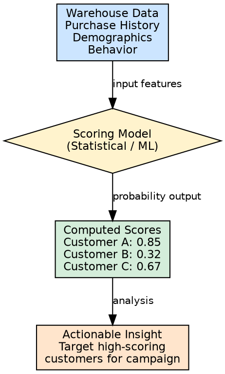
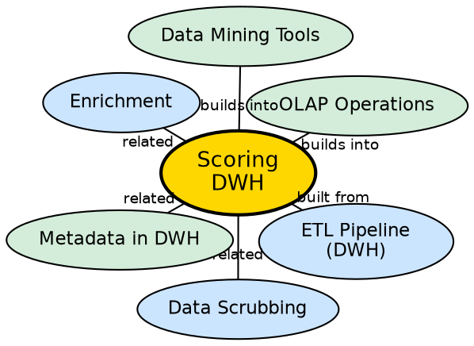

## The Problem

Raw operational data tells you what happened — a customer bought a product, a transaction occurred, a service was used. But it does not tell you what is **likely** to happen next. Businesses need predictive insights to act proactively: Which customer is most likely to churn? Which lead has the highest probability of converting? Without computed scores, the warehouse provides historical facts but no forward-looking intelligence.

## Core Idea

**Scoring** in the ETL context is the computation of probability scores for specific events or outcomes based on existing warehouse data. It applies statistical or machine learning models to compute a numerical probability that a particular event will occur — for example, the probability that a customer will buy a new product.

## How It Works

Scoring operates as a transformation sub-process within the ETL pipeline:

1. **Define the target event:** Specify what probability is being computed — purchase likelihood, churn risk, fraud probability, response rate.
2. **Select input features:** Identify which warehouse attributes are relevant predictors — past purchase history, customer tenure, frequency of visits, demographic attributes.
3. **Apply scoring model:** Execute a pre-built statistical or ML model against the warehouse data. The model outputs a probability score (0 to 1) for each record.
4. **Store scores in warehouse:** The computed scores are stored as new columns in the warehouse, making them available for analytical queries and reporting.
5. **Periodic recomputation:** Scores are recomputed during each ETL refresh cycle to reflect the latest data.

**Example:** A retail warehouse computes a "purchase likelihood score" for each customer based on their browsing history, past purchases, and demographic profile. The marketing team then targets customers with scores above 0.7 for a promotional campaign.

## Visual Explanation

## Semantic Network

## Key Properties

- **Probability-based:** Outputs numerical scores (0 to 1) representing likelihood of events
- **Model-driven:** Relies on pre-built statistical or machine learning models
- **Warehouse-native:** Uses existing warehouse data as input features
- **Periodically refreshed:** Scores are recomputed during each ETL cycle
- **Actionable:** Enables targeted marketing, risk assessment, and proactive decision-making

## Connections

- **Built from:** [[etl-pipeline-dwh|ETL Pipeline (DWH)]] — scoring is part of the Transform phase
- **Related:** [[data-scrubbing|Data Scrubbing]] — clean data is essential for accurate scoring
- **Related:** [[enrichment-dwh|Enrichment]] — external data can improve scoring model accuracy
- **Builds into:** [[olap-operations|OLAP Operations]] — scored data can be sliced and analyzed through OLAP
- **Builds into:** [[data-mining-tools|Data Mining Tools]] — scoring bridges ETL and data mining
- **Related:** [[metadata-in-dwh|Metadata in DWH]] — scoring model definitions stored in metadata

## Edge Cases & Gotchas

- **Model staleness:** Scoring models degrade over time as customer behavior changes. Models must be retrained periodically.
- **Score interpretation:** A score of 0.7 does not mean 70% certainty in all cases — calibration is needed.
- **Data bias:** If the training data is biased, the scores will be biased. This can lead to unfair targeting decisions.
- **Computational cost:** Scoring millions of records with complex models can significantly extend ETL run times.

## Sources

- [[dw1-summary|Source: Data Warehouse — Definitions, Architecture, ETL, OLAP]] — scoring as transformation sub-process
