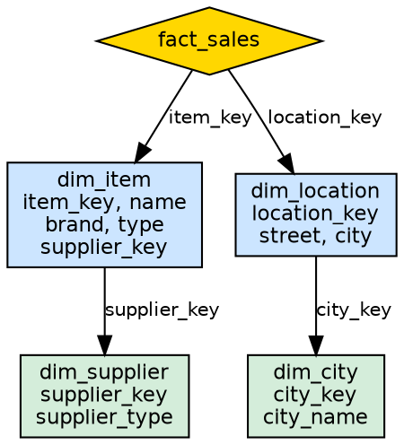
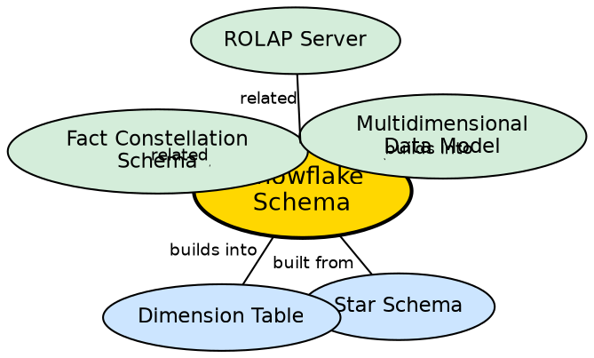

## The Problem

In a star schema, dimension tables are fully denormalized, leading to significant data redundancy. If a location dimension has 10,000 cities across 50 states and 10 countries, the "state" and "country" names are repeated thousands of times. This wastes storage space and can make dimension tables unwieldy. In some cases, this redundancy creates maintenance problems when attribute values need to be corrected.

## Core Idea

**Snowflake Schema** is an extension of the star schema where large dimension tables are **normalized** — split into additional tables to eliminate redundancy. The normalized dimensions branch out like a snowflake, creating a more complex but storage-efficient structure.

## How It Works

The snowflake schema takes the star schema's denormalized dimensions and normalizes them:

1. **Identify redundant attributes:** In the star schema's location dimension, "province_or_state" and "country" are repeated for every city in that state/country.
2. **Split into additional tables:**
   - The `location` dimension table is split: cities stay in the location table, but states move to a new `state` table, and countries to a `country` table.
   - The `item` dimension table is split: items stay in the item table, but suppliers move to a new `supplier` table.
3. **Establish hierarchical joins:** The fact table joins to the top-level dimension table, which joins to the next-level normalized table, and so on.
4. **Query impact:** A query that needed 1 join in the star schema may now need 2-3 joins in the snowflake schema.

**Example from source:**
- Star schema: `dim_item` contains `item_key, item_name, type, brand, supplier_type` (redundant supplier info)
- Snowflake schema: `dim_item` contains `item_key, item_name, type, brand, supplier_key` → joins to `dim_supplier` with `supplier_key, supplier_type`

## Visual Explanation

## Semantic Network

## Key Properties

- **Normalized dimensions:** Dimension tables split to eliminate redundancy
- **Storage efficient:** Less disk space needed compared to star schema
- **More joins required:** Queries need more joins, which can slow performance
- **Easier maintenance:** Updating a value (e.g., country name) requires changing only one record
- **Snowflake shape:** Normalized tables branch outward, creating a snowflake-like appearance

## Connections

- **Built from:** [[wiki/data-warehouse/star-schema|Star Schema]] — snowflake is a normalized variant of the star schema
- **Builds into:** [[wiki/data-warehouse/dimension-table|Dimension Table]] — normalized dimensions are still dimension tables
- **Related:** [[fact-constellation-schema|Fact Constellation Schema]] — another schema variant beyond star
- **Builds into:** [[multidimensional-data-model|Multidimensional Data Model]] — snowflake implements the dimensional model
- **Related:** [[rolap-server|ROLAP Server]] — ROLAP works well with snowflake schemas (relational tables)
- **Contrasts with:** [[wiki/data-warehouse/star-schema|Star Schema]] — the defining difference is normalization

## Edge Cases & Gotchas

- **Query performance degradation:** Each additional join in the snowflake adds query execution time. For very large warehouses, the star schema is usually faster.
- **Over-normalization:** Normalizing every dimension attribute creates a complex schema that is hard to understand and maintain. Only normalize large, highly redundant dimensions.
- **When to use snowflake:** Best when storage cost is a significant concern and query performance requirements are moderate.
- **Hybrid approach:** Some dimensions can be normalized (snowflake) while others remain denormalized (star) — a "partially snowflaked" schema.