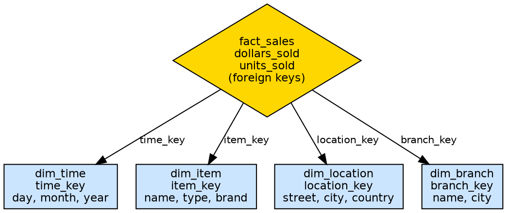
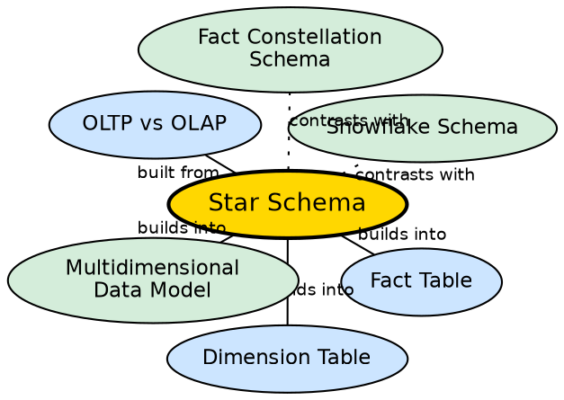

## The Problem

In a normalized OLTP database, answering a question like "What were total sales by city in Q1?" requires joining 5-6 tables (Sales, Customer, Address, City, State, Date). As data volumes grow to millions of rows, these multi-table joins become extremely slow. Analysts need a schema design that minimizes joins while still providing all the context needed for analysis.

## Core Idea

**Star Schema** is a dimensional modeling approach (developed by Ralph Kimball) where a central **fact table** containing measurable business events is surrounded by multiple **dimension tables** containing descriptive attributes. Each dimension table is **denormalized** — all attributes for a dimension live in a single table — minimizing the number of joins needed for analytical queries.

## How It Works

The star schema consists of two table types:

1. **Fact Table (center of the star):**
   - Contains measurable metrics (e.g., `dollars_sold`, `units_sold`).
   - Contains foreign keys to each dimension table.
   - One fact table per business process (e.g., Sales, Shipping).
   - Typically the largest table in the schema.

2. **Dimension Tables (points of the star):**
   - Each dimension is represented by **one single denormalized table**.
   - Contains descriptive attributes (e.g., Location dimension: `location_key, street, city, province_or_state, country`).
   - Not normalized — redundancy is accepted for query simplicity.
   - Joined to the fact table via a primary key.

**Example:** A sales star schema with four dimensions (Time, Item, Branch, Location):
- `fact_sales`: `time_key, item_key, branch_key, location_key, dollars_sold, units_sold`
- `dim_location`: `location_key, street, city, province_or_state, country`
- `dim_time`: `time_key, day, month, quarter, year`
- `dim_item`: `item_key, item_name, type, brand`
- `dim_branch`: `branch_key, branch_name, city`

A query for "total sales by city" joins only `fact_sales` with `dim_location` — a single join, not the 5+ joins a normalized schema would require.

## Visual Explanation

## Semantic Network

## Key Properties

- **One fact table, many dimension tables:** Central fact surrounded by dimensions
- **Denormalized dimensions:** All attributes in one table per dimension — redundancy accepted
- **Minimal joins:** Query typically needs only 1-2 joins
- **Simple to understand:** Resembles a star shape, intuitive for business users
- **Query performance:** Faster than normalized schemas for analytical queries

## Connections

- **Built from:** [[oltp-vs-olap|OLTP vs OLAP]] — star schema is the OLAP design paradigm
- **Builds into:** [[fact-table|Fact Table]] — the central table of the star
- **Builds into:** [[dimension-table|Dimension Table]] — the surrounding tables of the star
- **Contrasts with:** [[snowflake-schema|Snowflake Schema]] — star is denormalized, snowflake is normalized
- **Contrasts with:** [[fact-constellation-schema|Fact Constellation Schema]] — star has one fact table, constellation has multiple
- **Builds into:** [[multidimensional-data-model|Multidimensional Data Model]] — star schema implements the dimensional model

## Edge Cases & Gotchas

- **Data redundancy:** "Vancouver" and "Victoria" both repeat "British Columbia, Canada" in the location table. This is intentional — redundancy trades storage for query speed.
- **Slowly Changing Dimensions:** When a dimension attribute changes (customer moves cities), SCD techniques determine whether to overwrite, add a new row, or track history.
- **Not suitable for OLTP:** Star schema is optimized for reads, not writes. Using it for transactional operations leads to data integrity issues.
- **Degenerate dimensions:** Some low-cardinality attributes (order number, invoice number) are kept in the fact table rather than creating a separate dimension.