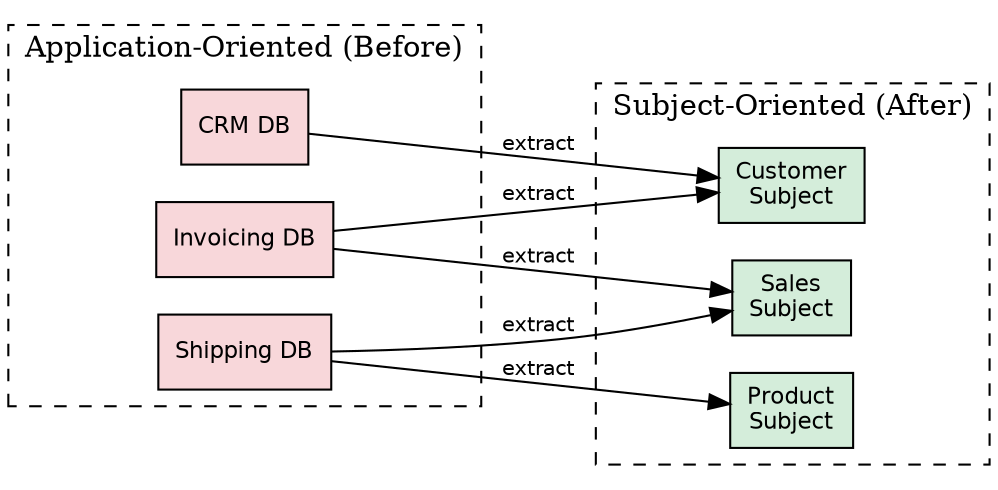
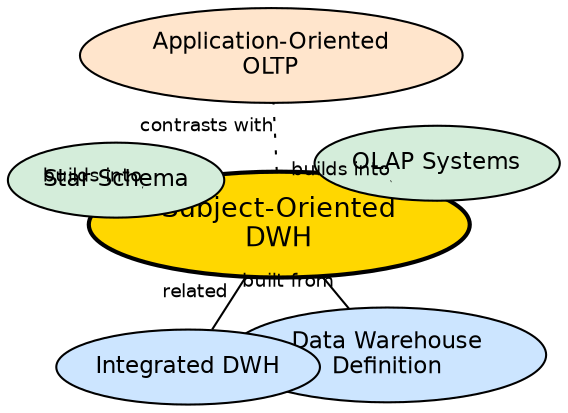

## The Problem

Traditional operational databases are organized around **applications** — there is a database for invoicing, another for shipping, another for HR. Each application has its own tables, its own data model, and its own definition of entities like "customer." When a manager wants to analyze "all customer interactions across the company," they must query multiple unrelated application databases and manually reconcile the results.

## Core Idea

A **subject-oriented** data warehouse organizes data around major business **subjects** (Customer, Product, Sales, Time) rather than around the applications that generate the data. This means all information related to a single subject is consolidated into one coherent view, regardless of which operational system originally produced it.

## How It Works

The shift from application-oriented to subject-oriented involves:

1. **Identify key subjects:** Determine the major entities the business needs to analyze — typically Customer, Product, Sales, Location, Time.
2. **Map sources to subjects:** For each subject, identify all operational systems that contain relevant data. For "Customer," this might include the CRM system, the billing system, the support ticket system, and the marketing database.
3. **Consolidate data:** Extract customer data from all sources, resolve conflicts (e.g., different customer IDs for the same person), and load into a unified subject table.
4. **Model for analysis:** Structure the subject tables with analysis in mind — denormalized attributes, clear hierarchies (City → State → Country), and time-stamped records.

**Example:** Instead of a "Sales_App_DB" and a "Shipping_App_DB," a subject-oriented warehouse has a "Sales" subject table and a "Product" subject table, each containing all relevant data regardless of source.

## Visual Explanation

## Semantic Network

## Key Properties

- **Analysis-first design:** Data organized for decision makers, not for transaction processing
- **Cross-application consolidation:** All data about a subject unified from multiple sources
- **Subject boundaries:** Common subjects include Customer, Product, Sales, Location, Time
- **Denormalization accepted:** Redundancy is tolerated if it makes analytical queries simpler and faster
- **Subject granularity:** Each subject can be analyzed at multiple levels (e.g., Customer → Household → Region)

## Connections

- **Built from:** [[data-warehouse-definition|Data Warehouse Definition]] — first of Inmon's four characteristics
- **Related:** [[integrated-dwh|Integrated]] — subject-orientation requires integration of heterogeneous sources
- **Builds into:** [[wiki/data-warehouse/star-schema|Star Schema]] — dimension tables are subject-oriented by design
- **Builds into:** [[oltp-vs-olap|OLTP vs OLAP]] — OLAP uses subject-oriented design, OLTP uses application-oriented design
- **Related:** [[data-mart-types|Data Mart Types]] — data marts are subject-oriented subsets for specific departments

## Edge Cases & Gotchas

- **Subject definition varies:** Different departments may define "Customer" differently (e.g., Marketing includes prospects, Sales only includes buyers). Resolution requires business-level agreement.
- **Not the same as normalization:** Subject-oriented means "organized by business topic," not "normalized to 3NF." In fact, subject-oriented warehouses are often denormalized.
- **Evolves over time:** New subjects emerge as business needs change — the warehouse schema must accommodate new subjects without breaking existing ones.