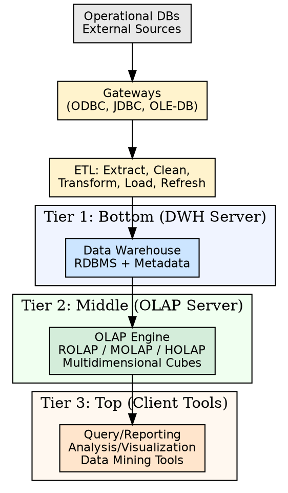
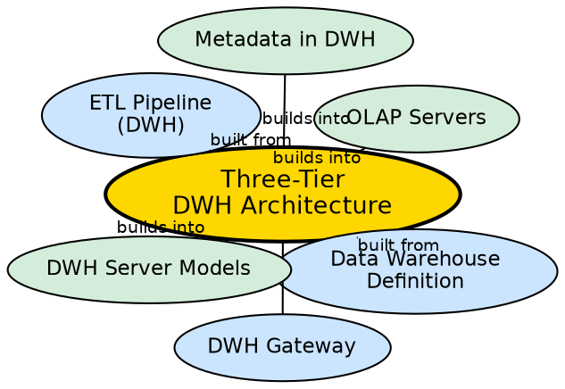

## The Problem

Raw operational data is scattered across multiple heterogeneous systems in inconsistent formats. End users cannot query these sources directly, and running analytical queries against them would crash the production systems. A single monolithic system that does everything — extract, store, analyze, and display — becomes a maintenance nightmare and a performance bottleneck.

## Core Idea

The **three-tier data warehouse architecture** separates concerns into three distinct layers: **Tier 1** (bottom) stores the raw warehouse data, **Tier 2** (middle) provides the OLAP engine for fast analytical querying, and **Tier 3** (top) presents results through front-end tools for end users. This modular design ensures that heavy analytical queries do not impact data storage, and each layer can scale independently.

## How It Works

Data flows upward through the three tiers:

1. **Tier 1 — Bottom Tier (Data Warehouse Server):**
   - The foundation layer, typically an RDBMS storing massive historical data.
   - Contains the **metadata repository** describing data origins, transformations, and schema.
   - Can be implemented as an Enterprise Warehouse, Data Marts, or Virtual Warehouse.
   - Receives data from operational databases and external sources through **gateways** (ODBC, JDBC, OLE-DB).
   - Data is processed through the ETL pipeline: Extract → Clean → Transform → Load → Refresh.

2. **Tier 2 — Middle Tier (OLAP Server):**
   - The analytics engine that maps relational data from Tier 1 into multidimensional cubes.
   - Implements one of: **ROLAP** (relational OLAP), **MOLAP** (multidimensional OLAP), **HOLAP** (hybrid), or specialized SQL servers.
   - Handles fast ad-hoc querying, slicing, dicing, roll-up, and drill-down operations.
   - Isolates heavy analytical processing from the storage layer.

3. **Tier 3 — Top Tier (Front-End Client Tools):**
   - The presentation layer where end users interact with the data.
   - Includes query/reporting tools (tabular data), analysis tools (charts/graphs), data mining tools (pattern recognition), and visualization tools.
   - Users never interact directly with the database — all requests go through the OLAP server.

## Visual Explanation

## Semantic Network

## Key Properties

- **Modular separation:** Each tier handles one concern — storage, analysis, or presentation
- **Independent scaling:** Heavy analytical load on Tier 2 does not impact Tier 1 storage
- **Gateway abstraction:** ODBC, JDBC, OLE-DB provide uniform access to heterogeneous sources
- **Metadata at Tier 1:** The warehouse server maintains metadata describing all warehouse objects
- **ETL feeds Tier 1:** Data enters through the bottom tier only, never directly from users

## Connections

- **Built from:** [[data-warehouse-definition|Data Warehouse Definition]] — the architecture implements Inmon's definition
- **Built from:** [[dwh-gateway|DWH Gateway]] — gateways connect Tier 1 to external sources
- **Built from:** [[etl-pipeline-dwh|ETL Pipeline (DWH)]] — ETL feeds data into Tier 1
- **Builds into:** [[olap-servers|OLAP Servers]] — Tier 2 is the OLAP server layer
- **Builds into:** [[dwh-server-models|DWH Server Models]] — Tier 1 can be Enterprise, Data Mart, or Virtual
- **Builds into:** [[metadata-in-dwh|Metadata in DWH]] — metadata repository resides in Tier 1
- **Related:** [[three-tier-dwh-architecture|Three-Tier DWH Architecture]] — the overall system design

## Edge Cases & Gotchas

- **High latency:** Data must traverse ETL before reaching users — the warehouse is never real-time.
- **Maintenance overhead:** Three separate layers require coordinated management and version control.
- **Tier 2 is the bottleneck:** The OLAP server's performance determines the end-user experience. If cubes are not pre-computed, queries will be slow.
- **Virtual warehouse skips Tier 1 storage:** In a virtual architecture, there is no physical warehouse — queries are routed directly to source systems.