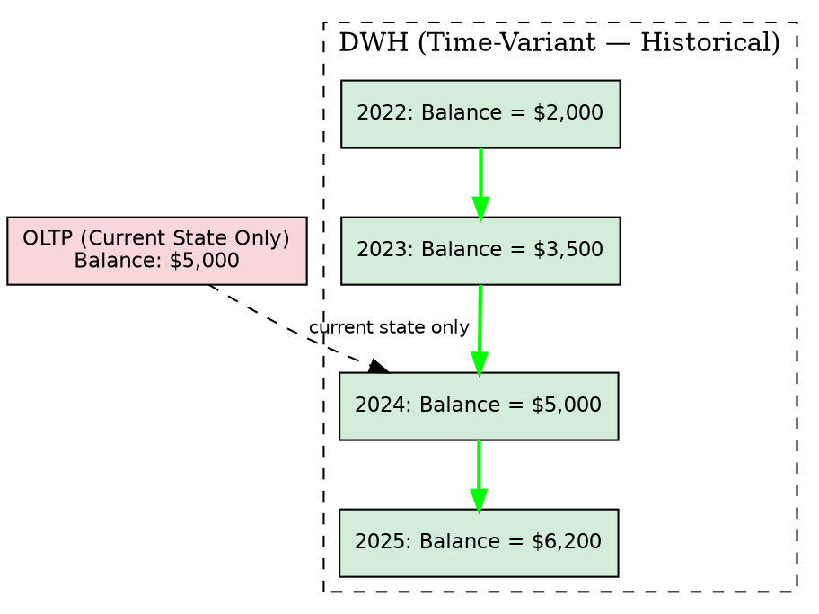
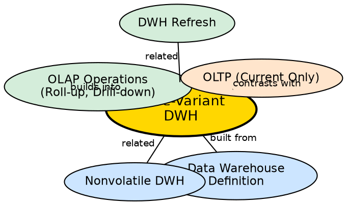

## The Problem

Operational databases are optimized for showing the **current state** — what is the customer's current balance, what is today's inventory level. But managers need to answer questions like "How has customer behavior changed over the past 5 years?" or "What was our revenue trend from 2019 to 2024?" Without historical data stored alongside timestamps, trend analysis and temporal comparisons are impossible.

## Core Idea

A **time-variant** data warehouse stores data with explicit or implicit time elements, providing a historical perspective that typically spans 5-10 years. Every key structure in the warehouse contains a time component, enabling analysis of how data changes over time rather than just its current value.

## How It Works

Time-variance is implemented through several mechanisms:

1. **Timestamping every record:** Each row in the warehouse includes a time element — either as an explicit timestamp column or implicitly embedded in the key structure (e.g., `date_id = 20240315`).
2. **Historical snapshots:** Instead of overwriting old values, the warehouse appends new records. If a customer's address changes, both the old and new addresses exist with their respective time ranges.
3. **Time hierarchies:** Data is organized along time dimensions with natural hierarchies: Day → Month → Quarter → Year. This enables roll-up (daily → monthly → yearly) and drill-down (yearly → quarterly → monthly).
4. **Periodic snapshots:** At regular intervals (daily, weekly, monthly), the warehouse captures the state of key metrics, creating a time-series of business snapshots.
5. **Slowly Changing Dimensions (SCDs):** Dimension tables use techniques (SCD Type 1, Type 2, Type 3) to track how descriptive attributes change over time.

This temporal depth enables year-over-year comparisons, trend identification, seasonal analysis, and forecasting — all impossible in an OLTP system that only maintains current state.

## Visual Explanation

## Semantic Network

## Key Properties

- **Historical depth:** Typically stores 5-10 years of data
- **Every key contains time:** Timestamps are explicit columns or implicit in key structures
- **Append-only growth:** New time-period data is appended; old data is never overwritten
- **Time hierarchies:** Day → Month → Quarter → Year for aggregation at different granularities
- **Temporal analysis:** Enables trend detection, year-over-year comparison, seasonality analysis

## Connections

- **Built from:** [[data-warehouse-definition|Data Warehouse Definition]] — third of Inmon's four characteristics
- **Built from:** [[nonvolatile-dwh|Nonvolatile]] — time-variance requires nonvolatility to preserve history
- **Builds into:** [[olap-operations|OLAP Operations]] — roll-up and drill-down operate on time hierarchies
- **Builds into:** [[dwh-scale|Data Warehouse Scale]] — historical accumulation is a primary driver of warehouse size
- **Contrasts with:** [[oltp-vs-olap|OLTP vs OLAP]] — OLTP maintains current state only; OLAP maintains full history
- **Related:** [[dwh-refresh|DWH Refresh]] — periodic refresh adds new time slices to the warehouse

## Edge Cases & Gotchas

- **Storage explosion:** Storing 10 years of daily snapshots creates massive data volumes. Archival and summarization strategies are essential.
- **Time zone complexity:** Global businesses must handle multiple time zones consistently — UTC is the standard choice.
- **"Time variant" ≠ "real-time":** Warehouses are periodically refreshed (nightly, weekly), not updated in real-time. The historical data is always slightly behind the operational systems.
- **Changing definitions over time:** A "customer" may be defined differently in 2019 vs. 2024. The warehouse must handle evolving business definitions.

## Sources

- [[dw1-summary|Source: Data Warehouse — Definitions, Architecture, ETL, OLAP]] — time-variant characteristic, historical perspective
