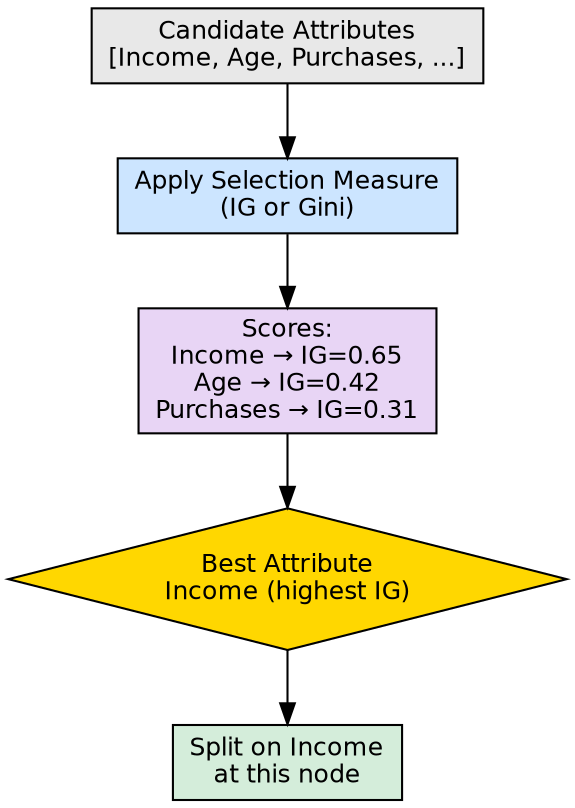

## The Problem

At every node in a decision tree, multiple attributes are candidates for splitting. Choosing the wrong attribute creates impure child nodes, leading to a deeper, less accurate, and less interpretable tree. A systematic evaluation framework is needed.

## Core Idea

Attribute Selection Measures are mathematical criteria used to evaluate and rank candidate attributes at each node, determining which attribute best separates the data into pure subsets. The two most popular measures are Information Gain (based on entropy reduction) and Gini Index (based on impurity probability).

## How It Works

The selection process at each node:

1. **Enumerate candidates**: List all available attributes (features) not yet used on the current path
2. **Score each attribute**: Apply the chosen measure (Information Gain or Gini Index) to evaluate each attribute
3. **Compare scores**: Rank attributes by their scores — highest IG or lowest Gini wins
4. **Select the best**: Assign the winning attribute to the current node
5. **Create branches**: Split the data based on the selected attribute's values

**Information Gain approach:**
- Calculates how much uncertainty decreases after the split
- Chooses the attribute with the highest IG
- Example: If splitting on "Outlook" reduces uncertainty from 0.95 to 0.3, IG = 0.65

**Gini Index approach:**
- Calculates the impurity of child nodes after the split
- Chooses the attribute with the lowest weighted Gini
- Example: If splitting on "Income" produces children with Gini 0.1 and 0.2, weighted average = 0.15

The source explicitly identifies these as "the two popular attribute selection measures used" in decision tree construction.

## Visual Explanation

## Key Properties

- **Greedy**: Evaluates one attribute at a time without considering future interactions
- **Deterministic**: Same data and measure always produce the same ranking
- **Measure-dependent**: Results differ between IG and Gini, though often similar in practice
- **Local optimization**: Best for the current node, not necessarily for the overall tree

## Connections

- **Built from:** [[information-gain|Information Gain]] — primary attribute selection measure
- **Built from:** [[gini-index|Gini Index]] — alternative attribute selection measure
- **Builds into:** [[decision-tree-splitting|Decision Tree Splitting]] — determines which attribute to split on
- **Builds into:** [[root-node|Root Node]] — root is selected via attribute selection
- **Builds into:** [[internal-node|Internal Node]] — each internal node uses attribute selection
- **Built from:** [[entropy|Entropy]] — entropy is the foundation of Information Gain
- **Related:** [[recursive-tree-building|Recursive Tree Building]] — attribute selection happens at every recursive step

## Edge Cases & Gotchas

- **ID3 bias**: Information Gain favors attributes with many distinct values (like IDs)
- **Ties are common**: Multiple attributes may score equally; tie-breaking affects tree structure
- **Measure choice matters**: Some datasets respond better to Gini, others to IG — no universal winner
- **No interaction detection**: Cannot detect that two weak attributes together would be strong

## Sources

- [[dtree-summary|Decision Tree in Machine Learning]] — identifies Information Gain and Gini Index as the two popular measures
