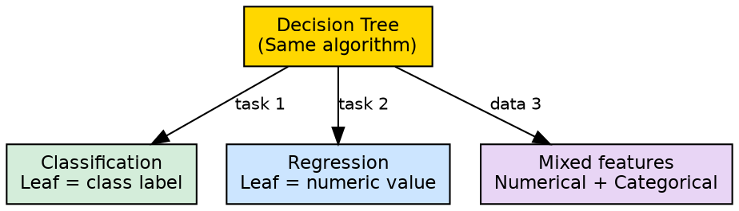

## The Problem

Machine learning workflows often require different models for different tasks — one algorithm for classification, another for regression, different handling for different data types. Maintaining expertise in multiple algorithms is costly, and switching between them adds complexity to the pipeline.

## Core Idea

Decision trees are flexible because the same algorithmic framework supports both classification (predicting discrete class labels) and regression (predicting continuous values), handles mixed feature types, and adapts to diverse problem domains without structural changes.

## How It Works

The flexibility manifests in three dimensions:

1. **Task flexibility**: The same tree structure works for both:
   - **Classification**: Leaf nodes store class labels; splits maximize class purity
   - **Regression**: Leaf nodes store mean values; splits minimize variance within nodes

2. **Data type flexibility**: Trees handle:
   - **Numerical features**: Split using threshold comparisons (e.g., "Age > 30")
   - **Categorical features**: Split using value matching (e.g., "Outlook = Sunny")
   - **Mixed features**: Numerical and categorical features coexist in the same tree

3. **Domain flexibility**: Trees are used across:
   - **Customer prediction**: Income, age, purchase history → buy/no buy
   - **Weather decisions**: Outlook, humidity, wind → activity selection
   - **Medical diagnosis**: Symptoms, test results → disease classification
   - **Business rules**: Revenue, region, segment → strategy recommendation

The source cites "flexibility" as one of the three main reasons decision trees are "widely used" — alongside interpretability and low preprocessing needs.

## Visual Explanation

## Key Properties

- **Unified framework**: One algorithm for classification and regression tasks
- **No task-specific modification**: The same code handles both tasks; only the leaf output differs
- **Feature-agnostic**: Works with any combination of numerical and categorical features
- **Domain-independent**: Applicable to any problem where decisions can be expressed as rules

## Connections

- **Built from:** [[classification|Classification]] — trees solve classification tasks
- **Built from:** [[regression|Regression]] — trees solve regression tasks
- **Built from:** [[decision-tree-preprocessing|Decision Tree Preprocessing]] — low preprocessing contributes to flexibility
- **Related:** [[supervised-learning|Supervised Learning]] — flexibility makes trees broadly applicable in supervised learning
- **Related:** [[decision-tree-interpretability|Decision Tree Interpretability]] — both are practical advantages
- **Related:** [[decision-tree-structure|Decision Tree Structure]] — the same structure supports both tasks

## Edge Cases & Gotchas

- **Not optimal for all tasks**: While flexible, trees may underperform specialized methods (e.g., CNNs for images)
- **Regression trees produce step functions**: Predictions are piecewise constant, not smooth
- **Classification requires discrete classes**: Trees cannot natively handle multi-label classification
- **Flexibility ≠ performance**: Being able to handle many tasks doesn't mean being best at any one