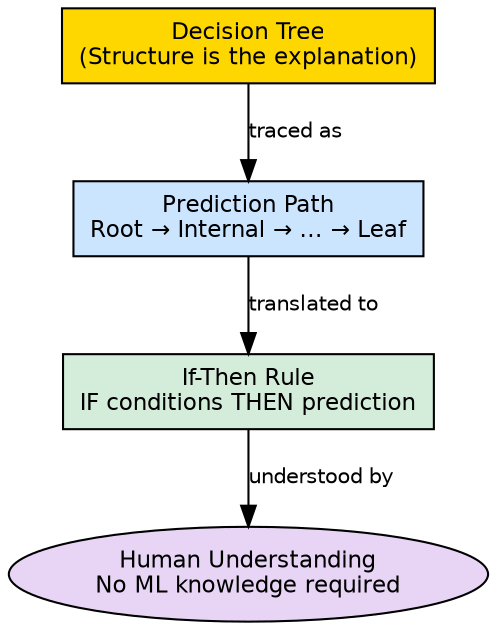

## The Problem

Most machine learning models — neural networks, ensemble methods, kernel machines — operate as black boxes. Their internal mechanisms are opaque, making it impossible to explain *why* a specific prediction was made. In regulated industries (healthcare, finance, legal), this lack of transparency is a dealbreaker.

## Core Idea

Decision trees are inherently interpretable because their prediction process mirrors human decision-making: a sequence of clear if-then rules. Every prediction can be traced as a path from root to leaf, producing an explanation that anyone — regardless of technical background — can understand and verify.

## How It Works

Interpretability comes from the tree's structure:

1. **Each node is a question**: "Is income > $50,000?" — a yes/no question anyone can answer
2. **Each path is a rule**: Following the path Income > 50K → Age > 30 → Purchases > 0 → "Purchase" translates directly to: "IF income > 50K AND age > 30 AND previous purchases > 0, THEN predict Purchase"
3. **No hidden transformations**: Unlike neural networks that apply opaque matrix multiplications, trees apply transparent logical tests
4. **Feature importance is visible**: Attributes near the root are the most important predictors; attributes never used are irrelevant

This interpretability is one of the reasons cited in the source for why "decision trees are widely used" — alongside flexibility and low preprocessing needs.

## Visual Explanation

## Key Properties

- **White-box model**: Internal logic is fully visible and inspectable
- **Rule extraction**: Every path from root to leaf is a complete if-then classification rule
- **Feature importance**: Root-proximal attributes are globally important; leaf-proximal are locally specific
- **No post-hoc explanation needed**: The model explains itself inherently, unlike LIME or SHAP for black boxes

## Connections

- **Built from:** [[decision-tree-structure|Decision Tree Structure]] — the structure provides the interpretability
- **Built from:** [[decision-tree-prediction|Decision Tree Prediction]] — the prediction path is the explanation
- **Contrasts with:** [[neural-networks|Neural Networks]] — neural networks are black boxes; trees are white boxes
- **Related:** [[supervised-learning|Supervised Learning]] — interpretability is a desirable property of supervised models
- **Related:** [[root-node|Root Node]] — root attribute is the most important feature globally
- **Builds into:** [[classification|Classification]] — interpretability is valuable for classification decisions

## Edge Cases & Gotchas

- **Deep trees lose interpretability**: A tree with 50 levels is no longer human-traceable
- **Post-pruning helps**: Reducing tree depth after training improves interpretability at the cost of accuracy
- **Feature interactions hidden**: While individual paths are clear, the global pattern across all paths may not be obvious
- **Not always honest**: An interpretable model can still be wrong; interpretability ≠ correctness