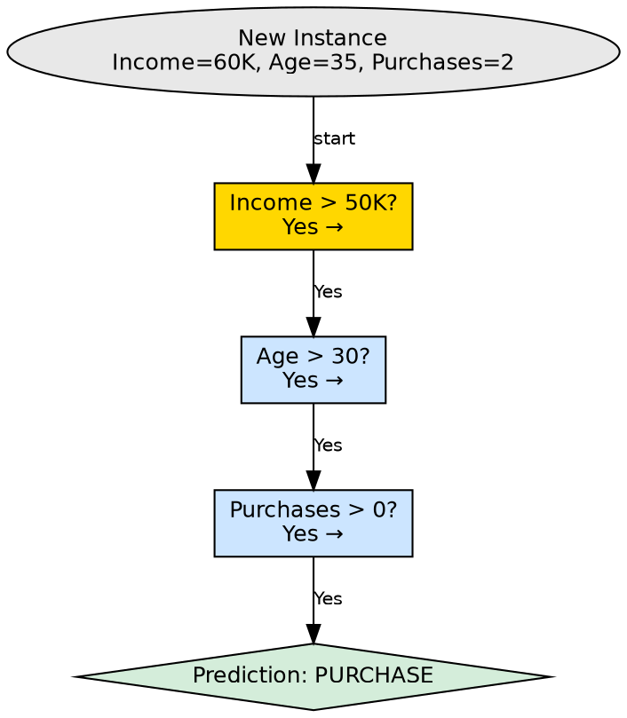

## The Problem

After a decision tree has been built, it needs to make predictions on new, unseen data. The mechanism for using the tree structure to classify a new instance must be simple, deterministic, and efficient.

## Core Idea

Decision tree prediction follows a single path from the root to a leaf by evaluating each node's attribute test on the instance's feature values. The prediction stored at the reached leaf node is returned as the tree's output.

## How It Works

The prediction process is a sequential traversal:

1. **Start at the root node**: Begin with the new instance at the top of the tree
2. **Evaluate the node's test**: Check the instance's feature value against the node's condition
3. **Follow the matching branch**: Move to the child node corresponding to the test outcome
4. **Repeat**: Continue evaluating tests and following branches until a leaf node is reached
5. **Return the leaf's prediction**: The class label (classification) or value (regression) stored at the leaf is the prediction

**Source example walkthrough:**
Predict whether a customer will buy a product:
- Instance: Income = $60,000, Age = 35, Previous Purchases = 2
- Step 1: Root node asks "Income > $50,000?" → Yes → follow Yes branch
- Step 2: Internal node asks "Age > 30?" → Yes (35 > 30) → follow Yes branch
- Step 3: Internal node asks "Previous Purchases > 0?" → Yes (2 > 0) → follow Yes branch
- Step 4: Leaf node → Prediction: **"Purchase"**

This process is O(depth) — the prediction time grows linearly with tree depth, not with training data size.

## Visual Explanation

## Key Properties

- **Deterministic**: The same instance always follows the same path to the same leaf
- **Fast**: O(depth) time — typically O(log n) for balanced trees
- **No data needed**: Prediction doesn't require the training dataset, only the tree structure
- **Interpretable**: The full decision path can be printed as an if-then rule

## Connections

- **Built from:** [[decision-tree-structure|Decision Tree Structure]] — prediction uses the tree's nodes and branches
- **Built from:** [[root-node|Root Node]] — prediction always starts at the root
- **Built from:** [[internal-node|Internal Node]] — internal nodes guide the traversal
- **Built from:** [[leaf-node|Leaf Node]] — leaf nodes provide the final prediction
- **Builds into:** [[classification|Classification]] — prediction outputs class labels
- **Builds into:** [[regression|Regression]] — prediction outputs continuous values
- **Related:** [[decision-tree-interpretability|Decision Tree Interpretability]] — the prediction path is human-readable

## Edge Cases & Gotchas

- **Missing features**: If the instance lacks a feature tested by an internal node, prediction cannot proceed without handling
- **Tree depth**: Very deep trees require many comparisons per prediction, slowing inference
- **Contradictory paths**: Two similar instances may reach different leaves if they differ on a single critical feature
- **No confidence score**: The basic prediction returns a class, not a probability (unless leaf stores class distribution)

## Sources

- [[dtree-summary|Decision Tree in Machine Learning]] — prediction example: Sunny + High Humidity → Swimming
