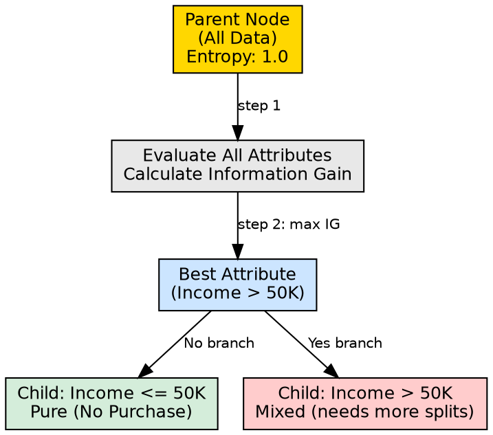

## The Problem

A decision tree needs to divide its dataset into progressively cleaner groups. The question of *how* to split — which attribute to use, at what threshold, and into how many groups — determines whether the tree will learn meaningful patterns or noise.

## Core Idea

Decision tree splitting is the process of partitioning a node's dataset into subsets based on an attribute's values. Each split creates child nodes, ideally with higher purity (fewer mixed classes) than the parent. The split is chosen to maximize Information Gain or minimize Gini impurity.

## How It Works

The splitting process follows these steps:

1. **Candidate evaluation**: For each available attribute, calculate the impurity reduction (Information Gain or Gini decrease) if that attribute were used to split
2. **Best attribute selection**: Choose the attribute with the highest Information Gain (or lowest weighted Gini Index)
3. **Partition creation**: Create one child node per possible value of the chosen attribute
4. **Data distribution**: Assign each training instance to the child node corresponding to its attribute value
5. **Recursive continuation**: Repeat the process for each child node that is not yet pure

For continuous attributes (like income or age), the algorithm finds an optimal threshold (e.g., "Income > $50,000?") by testing candidate thresholds and selecting the one that maximizes impurity reduction. The source example splits first on Income, then on Age, then on Previous Purchases — each split refining the prediction further.

## Visual Explanation

## Key Properties

- **Greedy**: Each split is locally optimal; the algorithm doesn't look ahead to future splits
- **Binary or multi-way**: Can split into two groups (threshold-based) or many groups (categorical attributes)
- **Purity-driven**: The goal is always to create purer child nodes than the parent
- **Irreversible**: Once data is split, it cannot be reassigned to a different branch

## Connections

- **Built from:** [[information-gain|Information Gain]] — primary metric for choosing splits
- **Built from:** [[gini-index|Gini Index]] — alternative metric for choosing splits
- **Builds into:** [[internal-node|Internal Node]] — each split creates internal nodes
- **Builds into:** [[node-purity|Node Purity]] — splitting aims to increase purity
- **Builds into:** [[recursive-tree-building|Recursive Tree Building]] — splitting is the recursive step
- **Related:** [[decision-tree-structure|Decision Tree Structure]] — splits define the tree's branches
- **Related:** [[attribute-selection-measures|Attribute Selection Measures]] — the framework for evaluating splits

## Edge Cases & Gotchas

- **Greedy trap**: The locally best split may prevent a globally better tree structure
- **Threshold sensitivity**: Small changes in continuous thresholds can dramatically alter split quality
- **Categorical explosion**: Attributes with many unique values (like IDs) can create artificially high Information Gain
- **No split improvement**: If no attribute improves purity, the node becomes a leaf instead of splitting