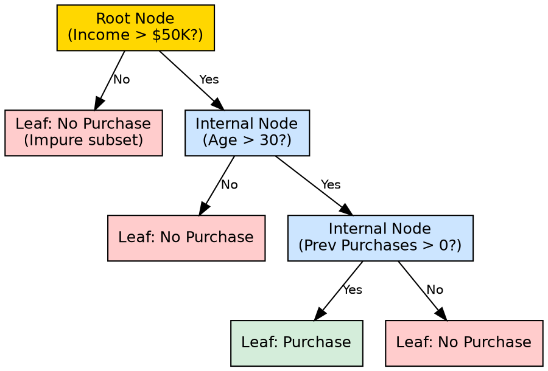

## The Problem

Machine learning models often function as black boxes — complex mathematical transformations that are nearly impossible for humans to understand or debug. When a model makes a wrong prediction, practitioners need to understand *why* to fix it, trust it, or explain it to stakeholders.

## Core Idea

A decision tree is a supervised learning algorithm with a hierarchical tree structure consisting of a root node (first split), internal nodes (attribute tests), branches (attribute values), and leaf nodes (final predictions). It works like a flowchart, making step-by-step decisions that anyone can follow from top to bottom.

## How It Works

The structure maps directly to how decisions are made:

1. **Root Node** — The topmost node representing the entire dataset. It performs the first and most important attribute test, chosen by the attribute selection measure (e.g., Information Gain or Gini Index).
2. **Internal Nodes** — Intermediate decision points, each representing a test on a specific feature/attribute. Every internal node asks a question like "Is income > $50,000?"
3. **Branches** — Edges connecting nodes, each representing a possible outcome of the attribute test. For a binary split, there are two branches (Yes/No); for multi-way splits, there are more.
4. **Leaf Nodes (Terminal Nodes)** — The bottommost nodes that cannot be split further. Each leaf holds a final prediction: a class label (classification) or a continuous value (regression).

The tree is built top-down: start with all data at the root, find the best attribute to split on, create child nodes for each outcome, and repeat recursively until stopping conditions are met.

## Visual Explanation

## Key Properties

- **Hierarchical**: Strictly top-down; no cycles or backtracking
- **Recursive**: Each subtree follows the same structural rules as the whole tree
- **Interpretable**: Any prediction path is human-readable as a sequence of if-then rules
- **Flexible**: Supports both classification (categorical leaves) and regression (numeric leaves)
- **Low preprocessing**: Handles mixed data types without scaling or normalization

## Connections

- **Built from:** [[supervised-learning|Supervised Learning]] — decision trees are a supervised algorithm family
- **Builds into:** [[decision-tree-prediction|Decision Tree Prediction]] — the structure determines how predictions are made
- **Built from:** [[root-node|Root Node]] — the entry point of every decision tree
- **Built from:** [[internal-node|Internal Node]] — intermediate decision points in the tree
- **Built from:** [[leaf-node|Leaf Node]] — terminal nodes holding predictions
- **Builds into:** [[decision-tree-splitting|Decision Tree Splitting]] — how nodes create child branches
- **Related:** [[entropy|Entropy]] — used to decide the best splits at each node
- **Related:** [[gini-index|Gini Index]] — alternative to entropy for choosing splits

## Edge Cases & Gotchas

- **Deep trees become unreadable**: A tree with 20+ levels loses its interpretability advantage
- **Missing structural info**: The structure itself doesn't indicate confidence — a leaf with 1 sample looks the same as one with 1000
- **Ordering matters**: The same dataset can produce structurally different trees depending on which attribute is chosen first
- **Empty branches**: Some attribute values may not appear in the training data, creating structural gaps

## Sources

- [[dtree-summary|Decision Tree in Machine Learning]] — source of tree anatomy, node types, and structural explanation
