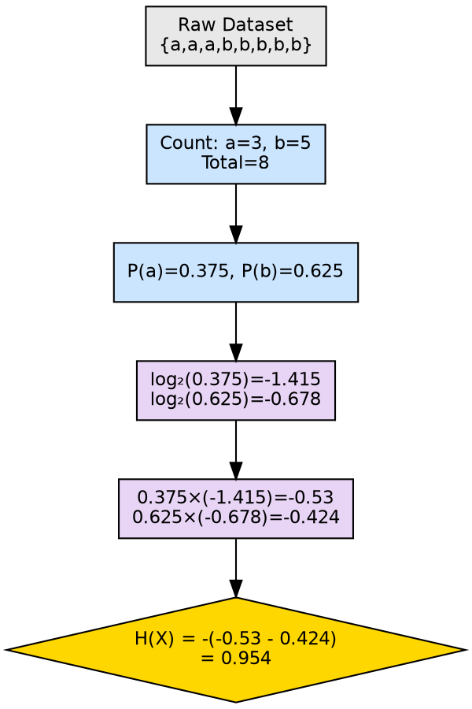

## The Problem

Understanding that entropy measures uncertainty is abstract; practitioners need to know exactly how to compute it on a real dataset to use it for attribute selection in decision trees.

## Core Idea

Entropy calculation involves counting class frequencies, computing their proportions, applying the log₂ function to each proportion, multiplying by the proportion, summing these products, and negating the result.

## How It Works

Step-by-step computation:

1. **Count instances per class**: Tally how many training examples belong to each class label
2. **Compute proportions**: Divide each class count by the total number of instances
3. **Apply log₂**: Take the base-2 logarithm of each proportion
4. **Weight by proportion**: Multiply each log value by its corresponding proportion
5. **Sum and negate**: Add all weighted log values and multiply by -1

**Worked example from source:**
Dataset X = {a, a, a, b, b, b, b, b}
- Total instances: 8
- Class a: 3 instances → P(a) = 3/8 = 0.375
- Class b: 5 instances → P(b) = 5/8 = 0.625

$$H(X) = -[0.375 \times \log_2(0.375) + 0.625 \times \log_2(0.625)]$$
$$= -[0.375 \times (-1.415) + 0.625 \times (-0.678)]$$
$$= -(-0.530 - 0.424)$$
$$= 0.954$$

The entropy of 0.954 (near the maximum of 1.0 for binary) confirms this dataset is highly impure.

## Visual Explanation

## Key Properties

- **Deterministic**: Same input always produces the same entropy value
- **O(c) computation**: Linear in the number of classes c (not in the number of instances)
- **Base-2 standard**: Log base 2 gives entropy in bits; natural log gives nats; base 10 gives hartleys
- **Zero handling**: When pᵢ = 0, the term pᵢ × log(pᵢ) is defined as 0

## Connections

- **Builds into:** [[entropy|Entropy]] — this is the computational method behind the concept
- **Builds into:** [[information-gain|Information Gain]] — entropy values are needed to compute IG
- **Built from:** [[node-purity|Node Purity]] — calculation quantifies the purity concept
- **Contrasts with:** [[gini-index|Gini Index]] — different computational approach to measuring impurity
- **Related:** [[decision-tree-splitting|Decision Tree Splitting]] — entropy values determine split quality
- **Related:** [[attribute-selection-measures|Attribute Selection Measures]] — entropy is used in Information Gain

## Edge Cases & Gotchas

- **Floating point precision**: Very small probabilities can cause numerical issues with log
- **Single-class shortcut**: If only one class exists, skip computation — entropy is 0
- **Large datasets**: Counting can overflow with huge datasets; use incremental or streaming approaches
- **Negative zero**: Some implementations may produce -0.0; normalize to 0.0 for consistency

## Sources

- [[dtree-summary|Decision Tree in Machine Learning]] — worked example: X = {a,a,a,b,b,b,b,b} yielding H(X) = 0.954
