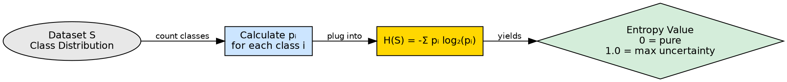

# Entropy

## The Problem

When building a decision tree, we need a mathematical way to quantify "how mixed up" a dataset is. Without a numerical measure of impurity, we cannot compare different split options or determine which attribute best separates the classes.

## Core Idea

Entropy is a measure of uncertainty or impurity in a dataset. It quantifies how unpredictable the class label of a randomly chosen instance would be. Higher entropy means more uncertainty (equal class distribution); entropy of 0 means perfect purity (all instances belong to one class).

## How It Works

Entropy is calculated using the probability distribution of class labels:

$$H(S) = -\sum_{i=1}^{c} p_i \log_2(p_i)$$

Where:
- $S$ is the dataset
- $c$ is the number of classes
- $p_i$ is the proportion of instances belonging to class $i$

**Key behaviors:**
- **Maximum entropy**: When classes are equally distributed (e.g., 3 "Yes" and 3 "No" → entropy ≈ 1.0)
- **Zero entropy**: When all instances belong to one class (e.g., 6 "Yes" and 0 "No" → entropy = 0)
- **Intermediate**: Any mixed distribution produces entropy between 0 and $\log_2(c)$

The source example calculates entropy for X = {a, a, a, b, b, b, b, b}:
- P(a) = 3/8 = 0.375, P(b) = 5/8 = 0.625
- H(X) = -[0.375 × log₂(0.375) + 0.625 × log₂(0.625)]
- H(X) = -[0.375 × (-1.415) + 0.625 × (-0.678)]
- H(X) = -(-0.53 - 0.424) = **0.954**

This high entropy (near 1.0) reflects that the dataset is quite mixed, with no dominant class.

## Visual Explanation

## Key Properties

- **Range**: 0 (pure) to log₂(c) (maximum impurity for c classes); for binary classification, range is [0, 1]
- **Log base 2**: Uses base-2 logarithm, so entropy is measured in bits
- **Additive**: Entropy of combined systems equals the sum of individual entropies (for independent systems)
- **Symmetric**: Depends only on the probability distribution, not on class labels or ordering

## Connections

- **Builds into:** [[information-gain|Information Gain]] — Information Gain is calculated as Entropy(parent) - weighted Entropy(children)
- **Built from:** [[node-purity|Node Purity]] — entropy is the mathematical formalization of purity
- **Contrasts with:** [[gini-index|Gini Index]] — both measure impurity but with different formulas and sensitivities
- **Builds into:** [[decision-tree-splitting|Decision Tree Splitting]] — entropy drives split decisions
- **Related:** [[attribute-selection-measures|Attribute Selection Measures]] — entropy is the foundation of Information Gain
- **Related:** [[entropy-calculation|Entropy Calculation]] — detailed formula and worked example

## Edge Cases & Gotchas

- **Log(0) undefined**: If a class has zero instances, that term is treated as 0 (by convention, 0 × log(0) = 0)
- **Multi-class scaling**: Entropy increases with the number of classes even at maximum impurity
- **Computation cost**: Logarithm calculations are more expensive than Gini's squaring
- **Not scale-invariant**: Entropy depends on proportions, not absolute counts — a 50/50 split of 10 samples has the same entropy as 50/50 of 10,000

## Sources

- [[dtree-summary|Decision Tree in Machine Learning]] — entropy definition, formula, and worked example with X = {a,a,a,b,b,b,b,b}
