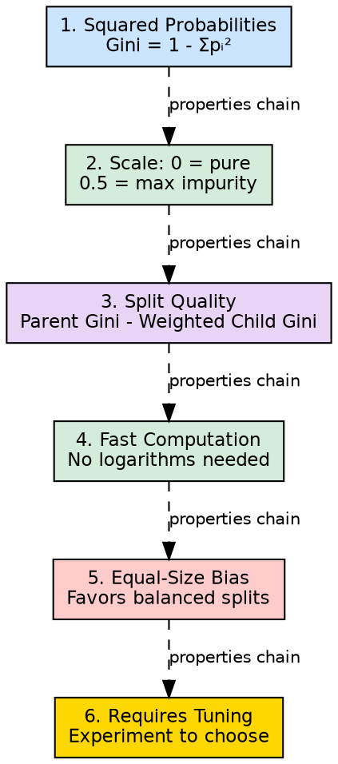

## The Problem

Knowing the Gini Index formula is not enough — practitioners need to understand its specific behaviors, strengths, weaknesses, and when it outperforms or underperforms compared to entropy to make informed algorithm choices.

## Core Idea

The Gini Index has six distinctive properties: it uses squared probability sums, indicates purity with lower values, evaluates split quality by comparing parent and child impurity, is faster to compute than entropy, favors equally-sized splits, and requires empirical tuning for optimal use.

## How It Works

These properties manifest in practice:

1. **Squared probability computation**: $Gini = 1 - \sum p_i^2$ — summing squared probabilities and subtracting from 1
2. **Lower = purer**: A Gini of 0 means perfect homogeneity (all same class); higher values indicate more mixing
3. **Split evaluation**: Compares parent impurity to weighted child impurity; the difference indicates split quality
4. **Computational speed**: Squaring is faster than logarithm calculation — significant for large datasets with many attributes
5. **Equal-size bias**: The math naturally rewards splits that divide data evenly, which may not always align with classification accuracy
6. **Problem-dependent**: No single impurity measure is universally best; the choice depends on the specific dataset and requires experimentation

## Visual Explanation

## Key Properties

- **Computationally efficient**: O(c) per split where c is number of classes — no expensive log operations
- **Bounded**: Always between 0 and 0.5 for binary, 0 and (1 - 1/c) for c classes
- **Continuous**: Smooth function of class probabilities, unlike some discrete measures
- **Skew-sensitive**: More responsive to probability changes near 0 or 1 than near 0.5

## Connections

- **Built from:** [[gini-index|Gini Index]] — this page details the specific properties of the Gini measure
- **Contrasts with:** [[entropy|Entropy]] — entropy uses logs (slower) but is information-theoretic
- **Builds into:** [[decision-tree-splitting|Decision Tree Splitting]] — properties affect split quality evaluation
- **Related:** [[entropy-vs-gini|Entropy vs Gini Compared]] — synthesis comparing both impurity measures
- **Built from:** [[attribute-selection-measures|Attribute Selection Measures]] — Gini is one of the measures
- **Related:** [[gini-index|Gini Index]] — the base concept this page elaborates

## Edge Cases & Gotchas

- **Equal-size trap**: A split creating 50/50 balanced but still impure groups may score better than an unbalanced but purer split
- **Sklearn default**: If you don't specify a criterion, sklearn uses "gini" — this may not be optimal for your data
- **Not comparable to entropy values**: A Gini of 0.3 does not correspond to an entropy of 0.3; they use different scales
- **Ties with entropy**: In most practical cases, Gini and entropy produce the same splits despite different values