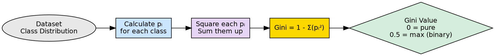

## The Problem

Entropy-based Information Gain requires logarithmic computations, which are relatively expensive. Decision tree algorithms need a faster impurity measure that produces similar quality splits without the computational overhead.

## Core Idea

The Gini Index measures the probability that a randomly chosen element from a dataset would be incorrectly classified if it were labeled according to the class distribution in that dataset. Lower Gini Index means purer subsets; a Gini of 0 indicates perfect purity.

## How It Works

The Gini Index formula:

$$Gini = 1 - \sum_{i=1}^{n} p_i^2$$

Where $p_i$ is the probability of class $i$ in the dataset.

**Key behaviors:**
- **Perfect purity (Gini = 0)**: All instances belong to one class → $\sum p_i^2 = 1$ → $Gini = 0$
  - Example: 100% "Yes" → $1 - 1^2 = 0$
- **Maximum impurity (binary, Gini = 0.5)**: Equal class distribution → $\sum p_i^2 = 0.5$ → $Gini = 0.5$
  - Example: 50% "Yes", 50% "No" → $1 - (0.25 + 0.25) = 0.5$

**How it's used in splitting:**
1. Calculate the Gini Index for each potential split
2. Compute the weighted Gini of the child nodes
3. Choose the split with the lowest weighted Gini Index

The Gini Index is the default criterion in scikit-learn's DecisionTreeClassifier. It is faster to compute than entropy (no logarithms needed — just squaring and summing probabilities) and is more sensitive to changes in class probabilities near the extremes.

## Visual Explanation

## Key Properties

- **Range [0, 0.5]**: For binary classification, Gini ranges from 0 (pure) to 0.5 (max impurity)
- **Faster than entropy**: No logarithm computation — only multiplication and addition
- **Sensitive to changes**: More responsive to shifts in class probabilities near the extremes
- **Default in sklearn**: The most commonly used impurity measure in practice

## Connections

- **Contrasts with:** [[entropy|Entropy]] — Gini uses squared probabilities; entropy uses logarithms
- **Builds into:** [[decision-tree-splitting|Decision Tree Splitting]] — Gini determines the best split
- **Built from:** [[node-purity|Node Purity]] — Gini quantifies the purity concept
- **Builds into:** [[attribute-selection-measures|Attribute Selection Measures]] — Gini is a selection criterion
- **Related:** [[information-gain|Information Gain]] — both serve the same purpose with different formulas
- **Builds into:** [[gini-index-properties|Gini Index Properties]] — detailed characteristics and trade-offs
- **Related:** [[entropy-vs-gini|Entropy vs Gini Compared]] — synthesis comparing both measures

## Edge Cases & Gotchas

- **Favors equal-sized splits**: Tends to prefer splits that create balanced child nodes, even if not optimal for accuracy
- **Multi-class scaling**: Maximum Gini increases with more classes: $1 - 1/c$ for $c$ classes
- **Near-pure insensitivity**: When nodes are nearly pure, Gini changes are very small, which can cause premature stopping
- **Not information-theoretic**: Unlike entropy, Gini has no connection to information theory or bits