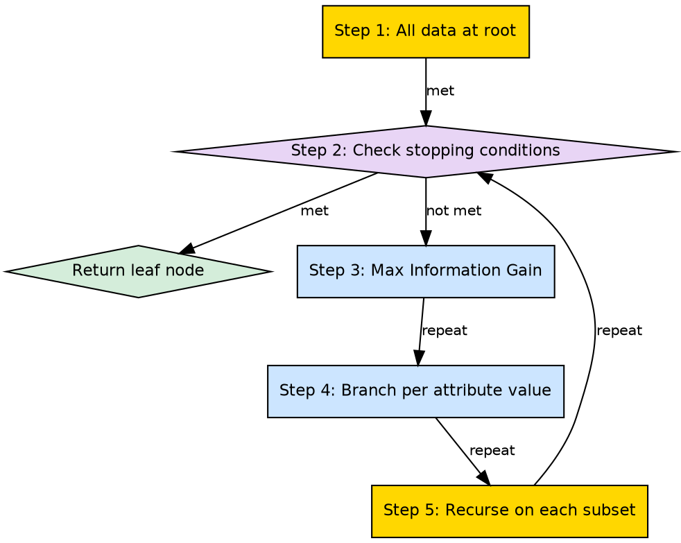

# ID3 Algorithm

## The Problem

To build a decision tree systematically, we need a concrete algorithm that specifies exactly how to choose attributes, how to split data, when to stop, and how to handle edge cases — not just the intuition but the precise step-by-step procedure.

## Core Idea

The ID3 (Iterative Dichotomiser 3) algorithm is the foundational decision tree construction algorithm that uses Information Gain as its attribute selection measure, builds the tree top-down recursively, and handles three stopping conditions: pure class, no attributes remaining, and no instances.

## How It Works

The ID3 algorithm follows these exact steps:

1. **Initialize**: Create the root node with all training instances
2. **Check stopping conditions**:
   - If all instances are positive → return leaf labeled "yes"
   - If all instances are negative → return leaf labeled "no"
   - If no attributes remain → return leaf with majority class
   - If no instances remain → return leaf with parent's majority class
3. **Select best attribute**: Calculate Information Gain for each remaining attribute and choose the one with maximum gain
4. **Create root**: Label the current node with the selected attribute
5. **For each value of the attribute**:
   a. Create a branch for that value
   b. Create a subset of instances matching that value
   c. If the subset is empty → attach leaf with majority class
   d. Otherwise → recursively call ID3 on the subset with remaining attributes
6. **Return**: The constructed tree

The source describes this as: "Start with all training instances associated with the root node. Use info gain to choose which attribute to label each node with. Recursively construct each subtree on the subset of training instances that would be classified down that path in the tree."

## Visual Explanation

## Key Properties

- **Greedy**: Never backtracks; each decision is final
- **Information Gain**: Uses entropy-based IG as the sole attribute selection criterion
- **Top-down**: Builds from root to leaves in a single pass
- **Discrete attributes**: Original ID3 handles only categorical attributes (C4.5 extension handles continuous)

## Connections

- **Built from:** [[information-gain|Information Gain]] — ID3 uses IG as its selection measure
- **Built from:** [[recursive-tree-building|Recursive Tree Building]] — ID3 is a specific recursive algorithm
- **Built from:** [[decision-tree-stopping-conditions|Decision Tree Stopping Conditions]] — ID3 uses the three standard stopping conditions
- **Builds into:** [[decision-tree-structure|Decision Tree Structure]] — ID3 produces the tree structure
- **Related:** [[entropy|Entropy]] — IG in ID3 is based on entropy
- **Contrasts with:** [[gini-index|Gini Index]] — CART algorithm uses Gini instead of IG
- **Related:** [[attribute-selection-measures|Attribute Selection Measures]] — ID3 pioneered the use of IG

## Edge Cases & Gotchas

- **No pruning**: Original ID3 does not include post-pruning, leading to overfitting
- **Continuous features**: ID3 cannot natively handle numerical features (requires discretization or C4.5)
- **Missing values**: ID3 has no built-in mechanism for handling missing data
- **Multi-valued bias**: Favors attributes with many distinct values (addressed by C4.5's Gain Ratio)

## Sources

- [[dtree-summary|Decision Tree in Machine Learning]] — ID3 steps: root initialization, IG selection, recursive construction, stopping conditions
