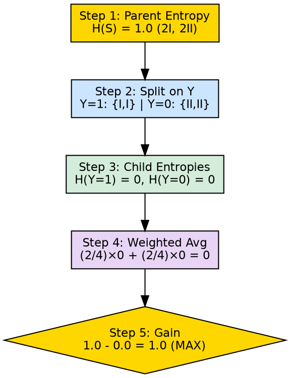

## The Problem

Knowing that Information Gain measures uncertainty reduction is conceptual; implementing a decision tree requires the precise computational steps to evaluate every candidate attribute at every node.

## Core Idea

Information Gain calculation involves computing the parent entropy, calculating each child's entropy after a hypothetical split, weighting each child entropy by its proportion of the total data, and subtracting this weighted sum from the parent entropy.

## How It Works

Detailed calculation procedure:

1. **Compute parent entropy**: Calculate Entropy(S) for the entire dataset at the current node
2. **For each candidate attribute A:**
   a. Partition S into subsets $S_v$ for each value $v$ of attribute A
   b. Calculate Entropy($S_v$) for each subset
   c. Compute the weighted average: $\sum \frac{|S_v|}{|S|} \times Entropy(S_v)$
   d. Subtract from parent entropy: $Gain(S, A) = Entropy(S) - \text{weighted average}$
3. **Select the attribute with maximum Gain**

**Worked example from source (split on attribute Y):**

Given dataset with 3 features (X, Y, Z) and 2 classes (I, II):

| X | Y | Z | C |
|---|---|---|---|
| 1 | 1 | 1 | I |
| 1 | 1 | 0 | I |
| 0 | 0 | 1 | II |
| 1 | 0 | 0 | II |

- Parent entropy: 2 of class I, 2 of class II → Entropy = 1.0
- Split on Y:
  - Y=1: 2 instances, both class I → Entropy = 0.0
  - Y=0: 2 instances, both class II → Entropy = 0.0
  - Weighted average: (2/4) × 0.0 + (2/4) × 0.0 = 0.0
  - **Gain(Y) = 1.0 - 0.0 = 1.0** (maximum possible)

Since splitting on Y produces perfectly pure children, Y is chosen as the root node, and no further splits are needed.

## Visual Explanation

## Key Properties

- **Per-attribute evaluation**: Must be computed for every candidate attribute at every node
- **Monotonic**: Adding more attributes to the dataset cannot decrease the maximum achievable IG
- **Computationally intensive**: Requires entropy calculation for each candidate split at each node
- **Greedy**: Computed locally without considering future splits

## Connections

- **Builds into:** [[information-gain|Information Gain]] — this is the computational procedure behind the concept
- **Built from:** [[entropy-calculation|Entropy Calculation]] — child entropy computations feed into IG
- **Builds into:** [[root-node|Root Node]] — IG calculation determines the root attribute
- **Builds into:** [[recursive-tree-building|Recursive Tree Building]] — IG is computed at every recursive step
- **Related:** [[decision-tree-splitting|Decision Tree Splitting]] — IG values drive the split decision
- **Contrasts with:** [[gini-index|Gini Index]] — different computational formula for the same goal

## Edge Cases & Gotchas

- **Division by zero**: If |S| = 0 (empty node), IG is undefined — the node should be a leaf
- **All same values**: If an attribute has the same value for all instances, only one child exists and IG = 0
- **Precision accumulation**: Repeated floating point operations can accumulate rounding errors in deep trees
- **Tie-breaking**: Multiple attributes may have identical IG; a deterministic tie-breaking rule is needed