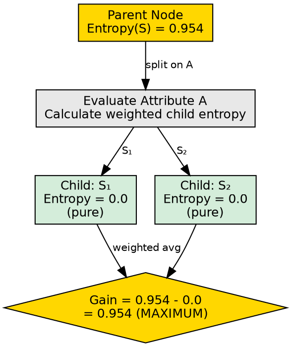

## The Problem

A decision tree needs to decide which attribute to test at each node. Simply picking attributes randomly produces useless trees. We need a principled way to quantify "how much does this attribute help us reduce uncertainty about the class label?"

## Core Idea

Information Gain measures how much the entropy (uncertainty) decreases after splitting a dataset on a particular attribute. The attribute with the highest Information Gain is chosen for the split, because it creates the clearest separation of classes.

## How It Works

Information Gain is computed as the difference between the parent node's entropy and the weighted average entropy of the child nodes:

$$Gain(S, A) = Entropy(S) - \sum_{v \in Values(A)} \frac{|S_v|}{|S|} \times Entropy(S_v)$$

Where:
- $S$ is the set of instances at the parent node
- $A$ is the candidate attribute
- $S_v$ is the subset of $S$ where attribute $A$ has value $v$
- $Values(A)$ is the set of all possible values of attribute $A$

**Interpretation:**
- **High IG**: The split creates very pure child groups (e.g., all "Young" bought, all "Old" didn't buy) → this attribute is very useful
- **Low IG**: The split barely changes the class distribution → this attribute provides little information
- **Zero IG**: The split produces children with the same impurity as the parent → this attribute is useless for this node

In the source example, splitting on age into "Young" and "Old" produced perfect separation (all young bought, all old didn't), resulting in maximum Information Gain.

## Visual Explanation

## Key Properties

- **Non-negative**: Information Gain is always ≥ 0 (a split cannot increase weighted entropy)
- **Maximum = parent entropy**: Achieved when all children are perfectly pure (entropy = 0)
- **Biased toward many-valued attributes**: Attributes with more unique values tend to have higher IG
- **Additive across nodes**: Total IG of a tree is the sum of IG at each split

## Connections

- **Built from:** [[entropy|Entropy]] — IG is the reduction in entropy after a split
- **Builds into:** [[decision-tree-splitting|Decision Tree Splitting]] — IG determines which split to choose
- **Built from:** [[entropy-calculation|Entropy Calculation]] — entropy values are the building blocks of IG
- **Builds into:** [[root-node|Root Node]] — root is chosen as the attribute with highest IG
- **Contrasts with:** [[gini-index|Gini Index]] — IG uses log-based entropy; Gini uses squared probabilities
- **Related:** [[attribute-selection-measures|Attribute Selection Measures]] — IG is the primary selection measure
- **Related:** [[information-gain-calculation|Information Gain Calculation]] — detailed formula and worked example

## Edge Cases & Gotchas

- **ID bias**: Attributes like customer ID have maximum IG (each value is unique) but are meaningless — this led to Gain Ratio
- **Zero IG**: If an attribute has the same value for all instances, IG = 0 and it should not be selected
- **Rounding errors**: Near-zero IG values may appear positive due to floating point precision
- **Not normalized**: IG values are absolute, not relative — a gain of 0.1 may be significant for one dataset but negligible for another

## Sources

- [[dtree-summary|Decision Tree in Machine Learning]] — Information Gain definition, formula, and age-splitting example
