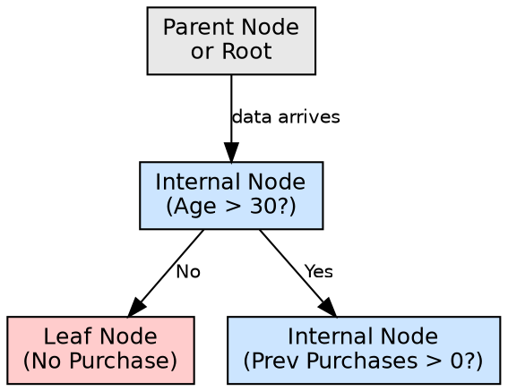

# Internal Node

## The Problem

After the initial root split, the data in each child branch is still not pure — multiple classes or values coexist. The tree needs a mechanism to keep asking questions and refining its predictions without prematurely stopping or over-splitting.

## Core Idea

An internal node (decision node) is any non-leaf node in a decision tree that represents an attribute test. Each internal node asks a question about a specific feature, and its branches represent the possible answers, directing the data flow to child nodes.

## How It Works

Internal nodes operate during both construction and prediction:

**During construction:**
1. The subset of data reaching this node is analyzed
2. Available attributes (excluding ancestors on this path) are evaluated
3. The best attribute is chosen using Information Gain or Gini Index
4. Branches are created for each possible value of the chosen attribute

**During prediction:**
1. The incoming instance reaches the internal node
2. The node evaluates its attribute test on the instance's feature value
3. Based on the answer, the instance is routed down the corresponding branch
4. This continues until a leaf node is reached

In the source example, "Age > 30?" and "Previous Purchases > 0?" are internal nodes that refine predictions after the root node's income check.

## Visual Explanation

## Key Properties

- **Attribute test**: Each internal node tests exactly one feature/attribute
- **Branching factor**: Number of outgoing branches equals the number of possible attribute values
- **Subset-specific**: Operates only on the data subset that reached this node, not the full dataset
- **Recursive role**: Internal nodes can have internal nodes as children, creating nested decision paths

## Connections

- **Built from:** [[decision-tree-splitting|Decision Tree Splitting]] — internal nodes are created by splitting
- **Builds into:** [[decision-tree-structure|Decision Tree Structure]] — internal nodes form the tree's intermediate layers
- **Builds into:** [[leaf-node|Leaf Node]] — internal nodes eventually terminate at leaves
- **Built from:** [[attribute-selection-measures|Attribute Selection Measures]] — chooses which attribute to test
- **Related:** [[root-node|Root Node]] — root is a special case of an internal node (the first one)
- **Builds into:** [[decision-tree-prediction|Decision Tree Prediction]] — internal nodes guide the prediction path

## Edge Cases & Gotchas

- **Feature reuse**: In some implementations, the same feature can be tested at multiple internal nodes along different paths
- **Exhausted attributes**: If all features have been used on a path, remaining internal nodes must use majority vote
- **Depth explosion**: Internal nodes can proliferate, creating trees too deep to interpret
- **Overfitting risk**: Each internal node adds complexity; too many internal nodes memorize training data

## Sources

- [[dtree-summary|Decision Tree in Machine Learning]] — internal nodes as attribute tests in customer prediction example
