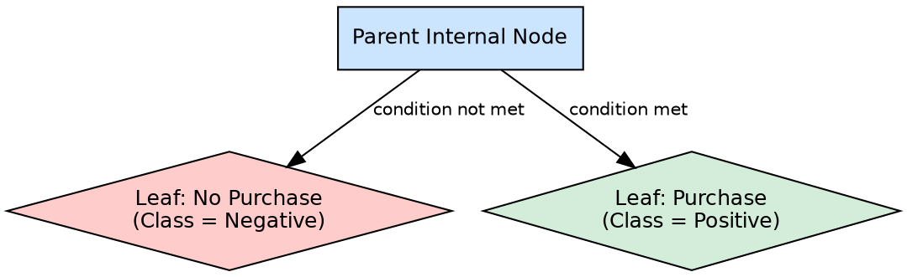

## The Problem

After a series of attribute tests, the tree must produce an actual output. Without terminal points that commit to a prediction, the tree would be an infinite chain of questions with no answers.

## Core Idea

A leaf node (terminal node) is the bottommost node in a decision tree that cannot be split further. Each leaf node represents a final decision or prediction — a class label in classification tasks, or a continuous numeric value in regression tasks.

## How It Works

Leaf nodes are created when stopping conditions are met during tree construction:

1. **Pure subset**: All instances in the node belong to the same class → leaf with that class label
2. **No remaining attributes**: No more features available to split on → leaf with majority vote of remaining instances
3. **No instances**: The node receives zero training instances → leaf with majority vote of the parent's instances
4. **Max depth reached**: Pre-configured depth limit is hit → leaf with majority prediction of current subset

During prediction, a leaf node is the endpoint:
- The incoming instance follows a path from root to leaf
- At the leaf, the stored prediction is returned as the tree's output
- In classification, this is a discrete class (e.g., "Purchase" or "No Purchase")
- In regression, this is typically the mean value of training samples that reached this leaf

The source example shows leaf nodes like "No Purchase" (when income ≤ $50K) and "Purchase" (when income > $50K, age > 30, and previous purchases > 0).

## Visual Explanation

## Key Properties

- **Terminal**: No outgoing branches — the decision path ends here
- **Holds prediction**: Stores the class label (classification) or numeric value (regression)
- **No impurity**: Ideally, all instances at a leaf belong to the same class
- **Majority vote fallback**: When impurity remains, predicts the most common class in the subset

## Connections

- **Builds into:** [[decision-tree-structure|Decision Tree Structure]] — leaves are the terminal elements of the tree
- **Built from:** [[decision-tree-stopping-conditions|Decision Tree Stopping Conditions]] — determines when a node becomes a leaf
- **Built from:** [[node-purity|Node Purity]] — pure subsets become leaves directly
- **Builds into:** [[decision-tree-prediction|Decision Tree Prediction]] — leaves provide the final output
- **Related:** [[classification|Classification]] — leaf nodes output class labels in classification
- **Related:** [[regression|Regression]] — leaf nodes output continuous values in regression

## Edge Cases & Gotchas

- **Single-sample leaves**: A leaf with one training sample is perfectly pure but almost certainly overfitted
- **Empty leaves**: Can occur when a branch has no training data; defaults to parent's majority class
- **Imbalanced leaf predictions**: A leaf may be dominated by one class but still contain minority class errors
- **Leaf depth variance**: Some leaves may be 2 levels deep, others 20 — leading to inconsistent prediction confidence

## Sources

- [[dtree-summary|Decision Tree in Machine Learning]] — leaf nodes as final predictions ("Purchase" / "No Purchase")
