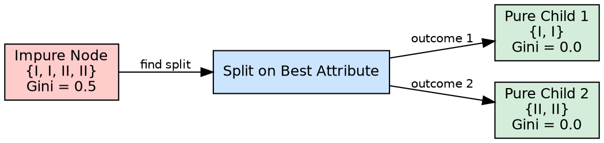

## The Problem

The entire goal of building a decision tree is to create groups where all members share the same class label. Without a clear definition of what "pure" means and how to measure it, we cannot evaluate whether a split is good or bad.

## Core Idea

Node purity refers to how homogeneous a subset of data is with respect to the target class. A perfectly pure node contains instances of only one class. An impure node contains a mix of classes. The goal of every split in a decision tree is to create child nodes that are purer than the parent.

## How It Works

Purity is quantified by impurity measures:

- **Entropy**: 0 = pure, log₂(c) = maximum impurity
- **Gini Index**: 0 = pure, 0.5 = maximum impurity (binary classification)

**The purity progression during tree building:**
1. Root node starts with the full dataset — typically impure (mixed classes)
2. A split is chosen that maximally increases purity in the child nodes
3. Each child node is evaluated: if pure enough, it becomes a leaf; if not, it splits again
4. This continues until all leaf nodes are pure (or stopping conditions prevent further splitting)

The source states: "A decision tree splits the dataset based on feature values to create pure subsets — ideally all items in a group belong to the same class." In the worked example, splitting on attribute Y produced children where one contained only class I and the other only class II — both perfectly pure.

## Visual Explanation

## Key Properties

- **Binary notion**: A node is either pure (one class) or impure (multiple classes)
- **Measurable**: Quantified by entropy, Gini Index, or other impurity metrics
- **Progressive**: Purity increases (impurity decreases) with each effective split
- **Local**: Purity is evaluated per-node, not globally across the tree

## Connections

- **Built from:** [[entropy|Entropy]] — entropy is one measure of (im)purity
- **Built from:** [[gini-index|Gini Index]] — Gini is another measure of (im)purity
- **Builds into:** [[decision-tree-splitting|Decision Tree Splitting]] — splitting aims to increase purity
- **Builds into:** [[leaf-node|Leaf Node]] — pure nodes become leaves
- **Related:** [[node-purity|Node Purity]] — the concept itself
- **Related:** [[information-gain|Information Gain]] — IG measures the purity increase from a split
- **Builds into:** [[recursive-tree-building|Recursive Tree Building]] — purity determines when to stop recursing

## Edge Cases & Gotchas

- **Perfect purity = overfitting**: A pure leaf with a single training instance memorizes noise
- **Near-purity is common**: Real-world data rarely achieves perfect purity; thresholds must be set
- **Purity ≠ accuracy**: A pure node may be "pure" but wrong if the training data has errors
- **Class skew**: In imbalanced datasets, a node can appear pure by being dominated by the majority class

## Sources

- [[dtree-summary|Decision Tree in Machine Learning]] — purity as the goal of splitting ("create pure subsets")
