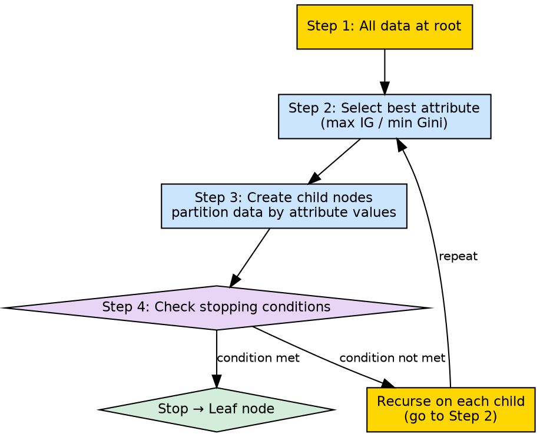

## The Problem

A decision tree cannot be built in a single pass — it needs to grow incrementally, making decisions at each node based on the data that reaches it, and stopping at the right time to avoid overfitting.

## Core Idea

Recursive tree building is the top-down algorithm that starts with all training data at the root, selects the best attribute using an attribute selection measure, creates child nodes for each attribute value, and then recursively applies the same process to each child node until stopping conditions are met.

## How It Works

The algorithm proceeds as follows:

1. **Start at root**: Associate all training instances with the root node
2. **Choose best attribute**: Use Information Gain (or Gini Index) to select the attribute that best splits the data
3. **Create branches**: For each possible value of the selected attribute, create a child node and assign the corresponding data subset
4. **Recurse on each child**: For each child node, repeat steps 2-3 using only the data subset that reached that node
5. **Apply stopping conditions** at each node:
   - **All same class**: If all instances at this node belong to one class → label the node with that class (leaf)
   - **No attributes left**: If no more attributes are available to split → label with majority vote of remaining instances
   - **No instances**: If the node receives zero instances → label with majority vote of the parent's instances
6. **Terminate**: When all branches end in leaf nodes, the tree is complete

The source describes this as: "Recursively construct each subtree on the subset of training instances that would be classified down that path in the tree."

## Visual Explanation

## Key Properties

- **Top-down**: Always starts from the full dataset and refines downward
- **Greedy**: Never reconsiders or backtracks on previous split decisions
- **Divide and conquer**: Each recursive call handles a smaller, simpler subset
- **Deterministic**: Given the same data and measure, always produces the same tree

## Connections

- **Built from:** [[decision-tree-splitting|Decision Tree Splitting]] — splitting is the recursive step
- **Built from:** [[attribute-selection-measures|Attribute Selection Measures]] — determines the best attribute at each step
- **Built from:** [[decision-tree-stopping-conditions|Decision Tree Stopping Conditions]] — determines when recursion terminates
- **Builds into:** [[decision-tree-structure|Decision Tree Structure]] — the result of recursive building
- **Related:** [[root-node|Root Node]] — the base case of the recursion
- **Related:** [[leaf-node|Leaf Node]] — the termination case of the recursion
- **Built from:** [[information-gain|Information Gain]] — common criterion for attribute selection

## Edge Cases & Gotchas

- **No base case**: If stopping conditions are not properly checked, the recursion may create infinite depth
- **Data fragmentation**: Deep recursion produces very small subsets that may not generalize
- **Attribute exhaustion**: Running out of attributes before reaching purity forces majority vote leaves
- **Memory growth**: Each recursive call holds its own data subset; deep trees consume significant memory