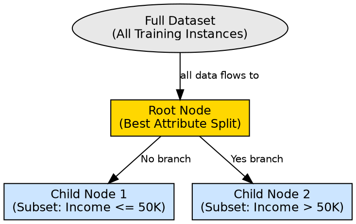

# Root Node

## The Problem

When building a decision tree from scratch, the first question matters most — it determines how the entire dataset is initially partitioned, and a poor first split cascades into suboptimal decisions throughout the tree.

## Core Idea

The root node is the topmost node of a decision tree, representing the entire training dataset. It performs the first and most impactful attribute test, chosen because it provides the maximum Information Gain (or minimum Gini impurity) among all available features.

## How It Works

During tree construction:

1. All training instances are associated with the root node
2. Every available attribute is evaluated using an attribute selection measure (Information Gain, Gini Index)
3. The attribute that best separates the data — creating the purest child subsets — is selected
4. The root node is labeled with this attribute and branches are created for each possible value
5. Each branch receives a subset of the data, which becomes the input for the corresponding child node

The root node is unique because it sees the full dataset. Its split has the largest potential impact on tree quality. In the customer purchase example from the source, "Income > $50K?" is chosen as the root because income is the strongest single predictor of whether someone will buy a product.

## Visual Explanation

## Key Properties

- **Maximum impact**: The root split affects every subsequent decision in the tree
- **Chosen by metric**: Selected via highest Information Gain or lowest Gini Index among all attributes
- **Single per tree**: Every decision tree has exactly one root node
- **Sees all data**: Unlike internal nodes, the root evaluates every training instance

## Connections

- **Builds into:** [[decision-tree-structure|Decision Tree Structure]] — root is the top element of the tree
- **Built from:** [[attribute-selection-measures|Attribute Selection Measures]] — determines which attribute becomes the root
- **Built from:** [[information-gain|Information Gain]] — common criterion for root selection
- **Built from:** [[gini-index|Gini Index]] — alternative criterion for root selection
- **Builds into:** [[internal-node|Internal Node]] — children of the root become internal nodes
- **Related:** [[decision-tree-splitting|Decision Tree Splitting]] — root performs the first split

## Edge Cases & Gotchas

- **Tied attributes**: Two features may have identical Information Gain; the choice is arbitrary and can affect tree shape
- **No good split**: If no attribute reduces impurity, the root becomes a leaf immediately (majority vote)
- **Sensitive to data changes**: Adding or removing a few samples can change which attribute is selected as root
- **Single point of failure**: A bad root choice cannot be corrected by later splits

## Sources

- [[dtree-summary|Decision Tree in Machine Learning]] — root node as starting point with Income example
