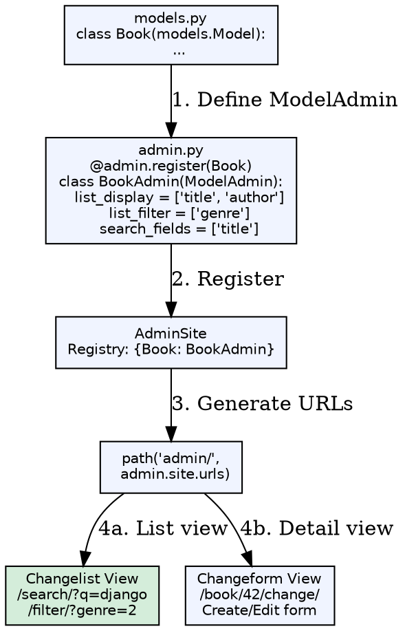
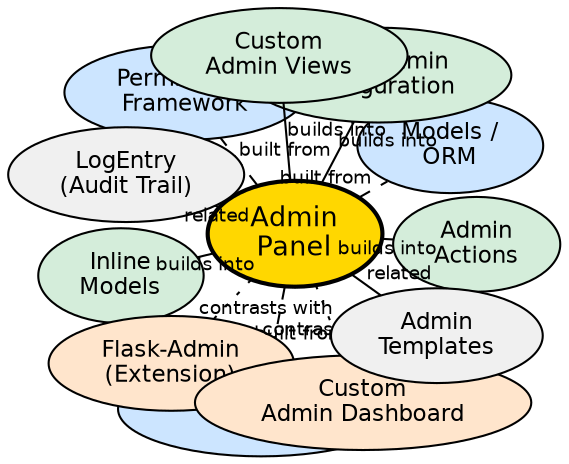

## Formal Definition

The Django Admin Panel is an auto-generated, model-centric administrative interface provided by `django.contrib.admin` that introspects registered models and provides CRUD operations, search, filtering, bulk actions, and permission-based access control through a declarative `ModelAdmin` configuration.

## Explanation

The admin panel solves the problem of building custom administrative interfaces for every data model. By registering a model with a `ModelAdmin` class, developers get a production-ready interface for viewing, creating, editing, and deleting records, with list views supporting search, filters, ordering, and pagination — all without writing HTML or view logic. It respects Django's authentication and permission system (`add`, `change`, `delete`, `view` per model).

## How It Works

1. **Models registered** — `admin.site.register(Model, ModelAdmin)` in `admin.py`
2. **Autodiscovery** — `admin.autodiscover()` (auto in Django 1.7+) imports `admin.py` from each `INSTALLED_APP`
3. **ModelAdmin options** — `list_display`, `list_filter`, `search_fields`, `ordering`, `readonly_fields`, `fieldsets`
4. **URLs included** — `path('admin/', admin.site.urls)` adds admin routes
5. **Request handled** — Admin views check permissions, render changelist/changeform templates
6. **Actions executed** — Bulk actions (delete, custom) process selected objects

## Visual Explanation

## Semantic Network

## Key Properties

- **Zero-code baseline**: `admin.site.register(Model)` gives functional CRUD immediately
- **ModelAdmin customization**: `list_display`, `list_filter`, `search_fields`, `date_hierarchy`, `ordering`, `raw_id_fields`, `autocomplete_fields`
- **Inlines**: `TabularInline`, `StackedInline` for editing related objects (FK, M2M) on parent form
- **Actions**: `actions = ['make_published']` — bulk operations on selected changelist rows
- **Permissions**: `has_add_permission`, `has_change_permission`, `has_delete_permission`, `has_view_permission`
- **Extensibility**: Override `changelist_view`, `changeform_view`, `get_queryset`, `save_model`, custom templates

## Connections

- Built from: [[models-orm|Models/ORM]] — Introspects model fields for UI
- Built from: [[authentication-system|Authentication System]] — Admin requires login
- Built from: [[permissions-framework|Permissions Framework]] — Per-model permissions
- Builds into: [[modeladmin-configuration|ModelAdmin Configuration]] — Customization options
- Builds into: [[inline-models|Inline Models]] — Edit related objects inline
- Builds into: [[admin-actions|Admin Actions]] — Bulk operations
- Contrasts with: [[flask-admin|Flask-Admin]] — Extension, not built-in, more manual config
- Contrasts with: [[custom-admin|Custom Admin Dashboard]] — Full control but more work
- Related: [[admin-templates|Admin Templates]] — Override `admin/change_list.html`, etc.
- Related: [[logentry|LogEntry (Audit Trail)]] — Tracks admin changes automatically

## Edge Cases & Gotchas

- **N+1 in list_display**: Accessing `obj.author.name` in `list_display` → use `list_select_related = ['author']`
- **Large tables**: `list_display` with many rows slow; add `list_per_page`, indexes, `raw_id_fields` for FK
- **M2M inlines**: Require `through` model for inline editing; default M2M widget is multi-select
- **Custom save logic**: Override `save_model()` not `save()` to respect admin workflow
- **Production exposure**: Admin at `/admin/` is a target; use `ADMIN_URL` obfuscation, IP whitelist, 2FA