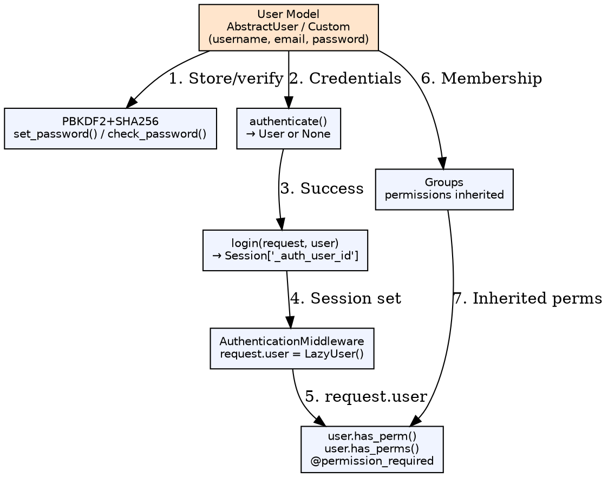
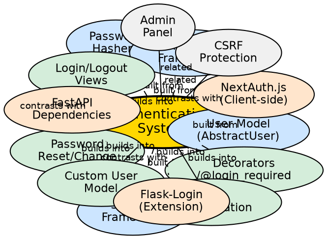

## Formal Definition

Django's Authentication System (`django.contrib.auth`) provides a complete user management framework including the `User` model (or custom user model), password hashing (PBKDF2 by default), session-based authentication, login/logout views, permission system (model-level and object-level), groups, and decorators/mixins for access control.

## Explanation

The auth system solves the problem of securely managing user identity, credentials, and access control in web applications. It handles user registration, login, logout, password reset/change, session management, and authorization through permissions and groups. The system is built on a swappable `User` model (default: `AbstractUser`), allowing customization while maintaining compatibility with admin, forms, and third-party packages.

## How It Works

1. **User model** — `AUTH_USER_MODEL` points to user class (default `auth.User` or custom)
2. **Password hashing** — `set_password()` uses PBKDF2+SHA256; `check_password()` verifies
3. **Login flow** — `authenticate(username, password)` → `login(request, user)` → sets session
4. **Session storage** — User ID stored in session; `request.user` populated by `AuthenticationMiddleware`
5. **Permission checks** — `user.has_perm('app.action_model')` or `@permission_required` decorator
6. **Groups** — Users inherit permissions from groups; `user.groups.add(group)`

## Visual Explanation

## Semantic Network

## Key Properties

- **Swappable User model**: `AUTH_USER_MODEL = 'myapp.CustomUser'` — must set before first migration
- **Password hashers**: `PASSWORD_HASHERS` setting; PBKDF2 default; supports bcrypt, argon2, scrypt
- **Session backend**: Database, cache, file, or signed cookies; `SESSION_ENGINE` setting
- **Permissions**: `add`, `change`, `delete`, `view` auto-created per model; custom via `Meta.permissions`
- **Object-level permissions**: Not built-in; use `django-guardian` or custom `has_perm` override
- **Auth backends**: `AUTHENTICATION_BACKENDS` — `ModelBackend` default; can add LDAP, OAuth, etc.

## Connections

- Built from: [[user-model|User Model]] — Core identity representation
- Built from: [[session-framework|Session Framework]] — Persists login state
- Built from: [[password-hashers|Password Hashers]] — Secure credential storage
- Built from: [[permissions-framework|Permissions Framework]] — Authorization layer
- Builds into: [[login-logout-views|Login/Logout Views]] — Built-in auth views
- Builds into: [[password-reset|Password Reset/Change]] — Token-based email flow
- Builds into: [[auth-decorators|Auth Decorators]] — `@login_required`, `@permission_required`
- Builds into: [[custom-user-model|Custom User Model]] — Extend/replace default User
- Builds into: [[drf-authentication|DRF Authentication]] — Token, JWT, Session auth for APIs
- Contrasts with: [[flask-login|Flask-Login]] — Extension, user loader callback, less integrated
- Contrasts with: [[fastapi-auth|FastAPI Dependencies]] — Dependency injection, no built-in User model
- Related: [[csrf-protection|CSRF Protection]] — Login forms need CSRF token
- Related: [[admin-panel|Admin Panel]] — Uses auth for admin access control

## Edge Cases & Gotchas

- **Custom user model timing**: Must set `AUTH_USER_MODEL` before *any* migrations; changing later is extremely difficult
- **`username` vs `email`**: Default User requires unique username; email not unique by default — customize for email-as-username
- **Session fixation**: `login()` rotates session key; `SESSION_COOKIE_HTTPONLY`, `SECURE` should be True in prod
- **Permission caching**: `user.get_all_permissions()` caches; `user.has_perm()` uses cache; `user = User.objects.get(...)` refreshes
- **`is_active` flag**: Inactive users can't login; `authenticate()` returns None for inactive users