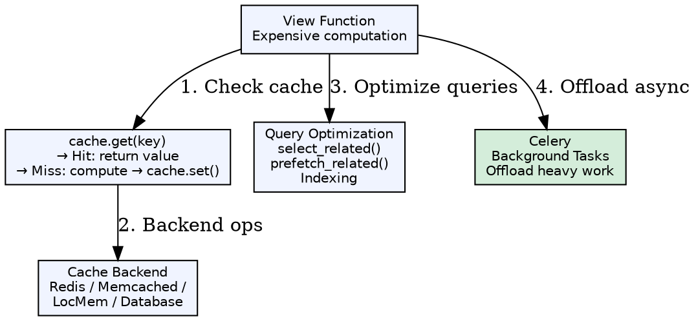
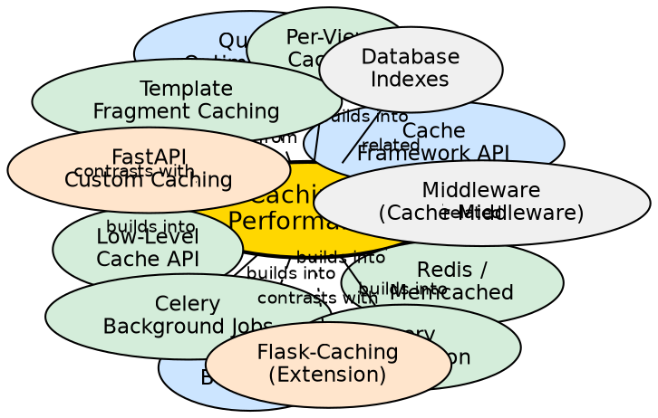

## Formal Definition

Django's Cache Framework provides a unified API for storing and retrieving computed data across multiple backends (in-memory, database, filesystem, Redis, Memcached) with support for per-site, per-view, template fragment, and low-level caching, while performance optimization encompasses query optimization (`select_related`, `prefetch_related`), database indexing, and asynchronous task offloading via Celery.

## Explanation

Caching solves the problem of repeated expensive computations (database queries, template rendering, API calls) by storing results for reuse. Django's cache API (`cache.get`, `cache.set`, `cache.get_or_set`) abstracts the backend, allowing development with local memory cache and production with Redis/Memcached. Performance optimization complements caching by reducing the need for it — efficient queries, proper indexes, and background processing keep response times low even on cache misses.

## How It Works

1. **Backend configured** — `CACHES = {'default': {'BACKEND': 'django.core.cache.backends.redis.RedisCache', 'LOCATION': 'redis://127.0.0.1:6379/1'}}`
2. **Cache key generated** — Unique string; `make_key('my_key', version=2)` includes prefix and version
3. **Set/Get operations** — `cache.set(key, value, timeout=300)`; `cache.get(key, default=None)`
4. **Per-view caching** — `@cache_page(60 * 15)` decorator caches entire response
5. **Template fragment** — `...`
6. **Low-level API** — `cache.add()` (only if not exists), `cache.incr()`, `cache.decr()`, `cache.delete_pattern()` (Redis)

## Visual Explanation

## Semantic Network

## Key Properties

- **Backends**: `LocMemCache` (dev, per-process), `RedisCache` (Django 4.0+, recommended), `MemcachedCache`, `DatabaseCache`, `FileBasedCache`
- **Key prefix**: `KEY_PREFIX` prevents collisions in shared Redis; `VERSION` for cache invalidation on schema changes
- **Timeouts**: `timeout` in seconds; `None` = forever; `0` = don't cache
- **Cache middleware**: `UpdateCacheMiddleware` + `FetchFromCacheMiddleware` for per-site caching (requires `CommonMiddleware`)
- **Query optimization**: `select_related` (FK/O2O → JOIN), `prefetch_related` (M2M/reverse FK → separate query), `only`/`defer` (field subset), `indexes` in Meta

## Connections

- Built from: [[cache-framework-api|Cache Framework API]] — Core `cache.get/set` interface
- Built from: [[cache-backends|Cache Backends]] — Pluggable storage implementations
- Built from: [[query-optimization|Query Optimization]] — Reduce DB load before caching
- Builds into: [[per-view-caching|Per-View Caching]] — `@cache_page` decorator
- Builds into: [[template-fragment-caching|Template Fragment Caching]] — `` tag
- Builds into: [[low-level-cache-api|Low-Level Cache API]] — `cache.get_or_set`, `incr`, `delete_pattern`
- Builds into: [[redis-memcached|Redis/Memcached]] — Production backends
- Builds into: [[celery-background-jobs|Celery Background Jobs]] — Async task processing
- Builds into: [[query-optimization-techniques|Query Optimization Techniques]] — `select_related`, `prefetch_related`, indexes
- Contrasts with: [[flask-caching|Flask-Caching]] — Extension, similar API, less integrated
- Contrasts with: [[fastapi-caching|FastAPI Custom Caching]] — No built-in framework, manual implementation
- Related: [[cache-middleware|Cache Middleware]] — Site-wide caching layer
- Related: [[database-indexes|Database Indexes]] — Complementary performance tool

## Edge Cases & Gotchas

- **LocMemCache in production**: Per-process, not shared across workers; use Redis/Memcached
- **Cache stampede**: Multiple workers compute same missing key; use `cache.add()` + lock or `get_or_set` with callable
- **Cache invalidation**: Hard problem; versioned keys (`cache.set(f'v{version}:key', val)`) or signals on model save
- **Query optimization order**: `select_related` before `filter`; `prefetch_related` with `Prefetch` object for filtered prefetch
- **Celery serialization**: Default pickle; use `json` serializer for security; task args must be JSON-serializable