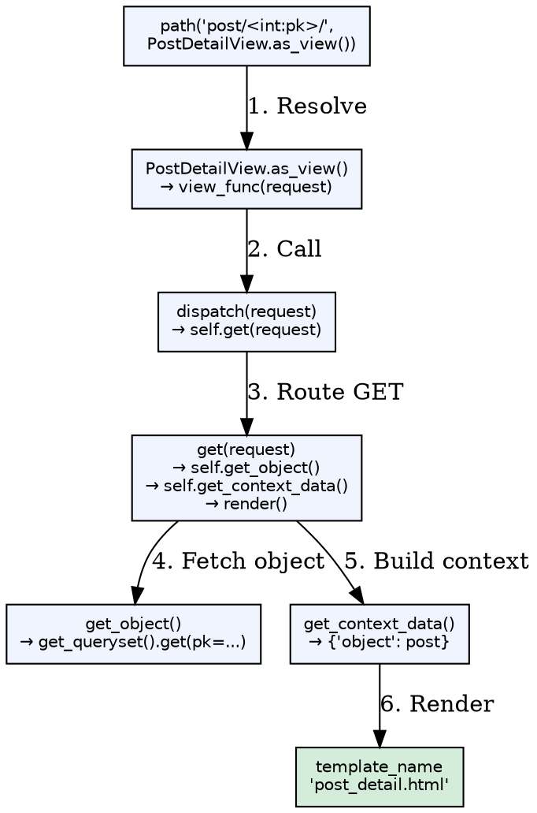
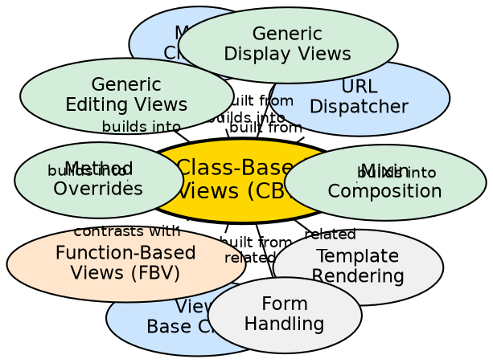

## Formal Definition

Class-Based Views (CBVs) are Django's object-oriented view pattern where views are Python classes inheriting from `View` or generic view classes (`TemplateView`, `ListView`, `DetailView`, `CreateView`, `UpdateView`, `DeleteView`), with behavior defined by overriding methods (`get`, `post`, `get_queryset`, `get_context_data`) and composed via mixins.

## Explanation

CBVs solve the problem of repetitive boilerplate in common view patterns (list, detail, create, update, delete) by providing reusable base classes that implement standard CRUD workflows. Instead of writing `if request.method == 'POST':` in every function, developers override specific methods (`form_valid`, `get_queryset`) and the framework handles the rest. Mixins (`LoginRequiredMixin`, `PermissionRequiredMixin`) compose cross-cutting concerns declaratively.

## How It Works

1. **URL maps to `as_view()`** — `path('post/<int:pk>/', PostDetailView.as_view(), name='detail')`
2. **`as_view()` returns callable** — Factory function that instantiates view class per request
3. **`dispatch()` routes by method** — Calls `get()`, `post()`, `put()`, `delete()`, etc.
4. **Generic views provide defaults** — `ListView` paginates `get_queryset()`; `CreateView` handles form GET/POST
5. **Method overrides customize** — `get_queryset()`, `get_context_data()`, `form_valid()`, `get_success_url()`
6. **Mixins inject behavior** — `LoginRequiredMixin` adds `dispatch` check; `SuccessMessageMixin` adds messages

## Visual Explanation

## Semantic Network

## Key Properties

- **Base `View` class**: Implements `dispatch()`, `http_method_not_allowed()`, `options()`
- **Generic display views**: `TemplateView` (render template), `ListView` (paginated list), `DetailView` (single object)
- **Generic editing views**: `FormView` (form handling), `CreateView`, `UpdateView`, `DeleteView` (model CRUD)
- **Mixin pattern**: `LoginRequiredMixin`, `PermissionRequiredMixin`, `UserPassesTestMixin`, `SuccessMessageMixin`
- **MRO matters**: Mixin order affects method resolution; `LoginRequiredMixin` before `View` for auth check

## Connections

- Built from: [[url-dispatcher|URL Dispatcher]] — Targets `as_view()` callable
- Built from: [[view-base-class|View Base Class]] — `django.views.View` foundation
- Built from: [[mixin-classes|Mixin Classes]] — Composable behavior units
- Builds into: [[generic-display-views|Generic Display Views]] — `ListView`, `DetailView`, `TemplateView`
- Builds into: [[generic-editing-views|Generic Editing Views]] — `CreateView`, `UpdateView`, `DeleteView`
- Builds into: [[method-overrides|Method Overrides]] — `get_queryset`, `get_context_data`, `form_valid`
- Builds into: [[mixin-composition|Mixin Composition]] — Stacking `LoginRequiredMixin`, etc.
- Contrasts with: [[function-based-views|Function-Based Views]] — Explicit vs implicit, granular vs convention
- Related: [[template-engine|Template Rendering]] — `template_name`, `get_template_names()`
- Related: [[forms-modelforms|Form Handling]] — `form_class`, `get_form()`, `form_valid()`

## Edge Cases & Gotchas

- **`get_object()` 404**: `DetailView` calls `get_object()` which raises 404; override for custom lookup
- **`success_url` vs `get_success_url()`**: Static string vs dynamic (e.g., `reverse_lazy` or object method)
- **MRO conflicts**: Multiple mixins overriding same method — order in class declaration matters
- **`context_object_name`**: `ListView` uses `object_list`; `DetailView` uses `object`; customize for clarity
- **Form kwargs**: `CreateView`/`UpdateView` pass `instance` to form; `get_form_kwargs()` for extra data