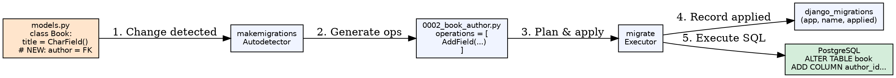
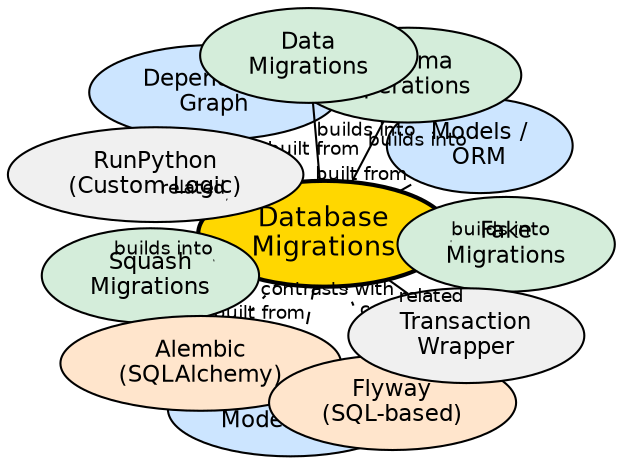

## Formal Definition

Database Migrations are Django's version-control system for database schema, represented as Python files containing `Operations` (CreateModel, AddField, AlterField, RunSQL, RunPython) that transform the database from one state to another, tracked in the `django_migrations` table to ensure idempotent application across environments.

## Explanation

Migrations solve the problem of evolving database schema alongside code without manual SQL scripts or data loss. When models change, `makemigrations` generates a new migration file by comparing current models to the historical state reconstructed from previous migrations. `migrate` applies unapplied migrations in dependency order, recording each in `django_migrations`. This enables team collaboration, CI/CD integration, and safe rollbacks (when operations are reversible).

## How It Works

1. **Models changed** — Developer modifies `models.py` (add field, change type, new model)
2. **Autodetector runs** — `makemigrations` compares current models to project state from last migration
3. **Operations generated** — Creates `Migration` class with `operations = [AddField(...), ...]`
4. **Dependencies resolved** — Migration declares `dependencies = [('app', '0001_initial'), ...]`
5. **Migration applied** — `migrate` runs operations in topological order, updates `django_migrations`
6. **State reconstructed** — Future `makemigrations` replays all migrations to compute current state

## Visual Explanation

## Semantic Network

## Key Properties

- **Declarative operations**: `CreateModel`, `AddField`, `AlterField`, `RemoveField`, `RunSQL`, `RunPython`
- **Dependency graph**: Linear per-app, cross-app via `dependencies`; topological sort ensures order
- **Reversibility**: Most operations auto-reversible; `RunPython` needs `reverse_code`; `RunSQL` needs reverse SQL
- **Squashing**: `squashmigrations` combines many migrations into one for faster initial setup
- **Historical models**: `apps.get_model('app', 'Model')` in `RunPython` uses frozen model state

## Connections

- Built from: [[models-orm|Models/ORM]] — Source of schema changes
- Built from: [[historical-model-state|Historical Model State]] — Baseline for autodetection
- Builds into: [[schema-operations|Schema Operations]] — Individual migration steps
- Builds into: [[data-migrations|Data Migrations]] — `RunPython` for data transformation
- Builds into: [[squash-migrations|Squash Migrations]] — Optimize migration history
- Contrasts with: [[alembic|Alembic]] — SQLAlchemy's migration tool, similar but separate ecosystem
- Contrasts with: [[flyway|Flyway]] — SQL-file based, not ORM-coupled
- Related: [[database-transactions|Transaction Wrapper]] — Each migration in transaction (except PostgreSQL DDL)
- Related: [[runpython|RunPython]] — Custom data migration logic

## Edge Cases & Gotchas

- **Non-reversible migrations**: `RunPython` without `reverse_code` blocks rollback; `migrate --fake` risky
- **Concurrent migrations**: Two developers create `0003_...` — resolve with `makemigrations --merge`
- **Large table ALTER**: Adding column with default locks table; use `AddField` → `RunSQL` (no default) → `AlterField`
- **Historical model drift**: `RunPython` using current model instead of `apps.get_model()` breaks future migrations
- **Swap app models**: `swappable = 'AUTH_USER_MODEL'` requires special handling in migrations

## Sources

- [[django-summary|Django Learning Roadmap]]