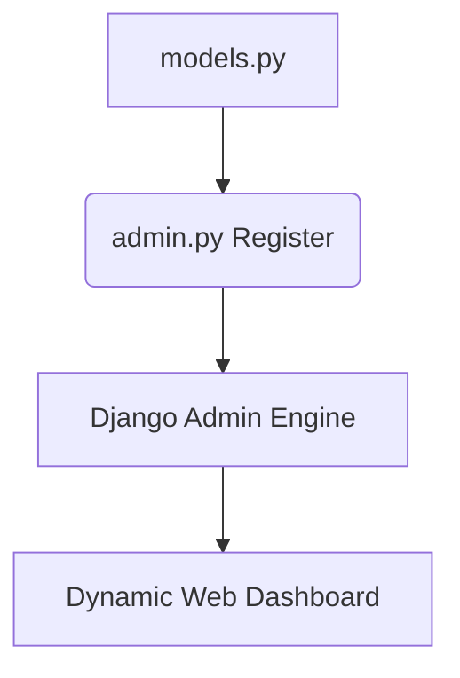
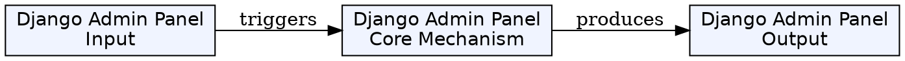
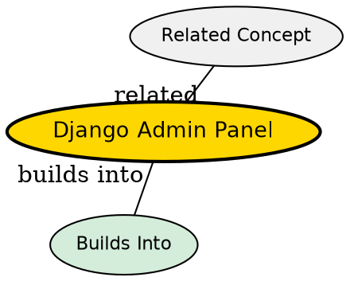

## Formal Definition

The Django Admin Panel is a built-in, dynamically generated graphical user interface that allows trusted users (administrators) to perform Create, Read, Update, and Delete (CRUD) operations on the application's database models.

## Explanation

Building a dashboard to manage users, products, or posts is time-consuming. Django provides this out of the box. By registering your models with the admin app, it automatically reads your schema and builds a complete dashboard to manage that data.

## How It Works

1. The `django.contrib.admin` app is included in `INSTALLED_APPS`.
2. A superuser is created (`python manage.py createsuperuser`).
3. Developer registers models in an app's `admin.py`.
4. The admin panel reads the model fields and generates forms and list views automatically.
5. Configurable via `ModelAdmin` classes to add search, filters, and custom layouts.

## Visual Explanation



## Mental Model & Analogy

The Admin Panel is like the back-office control room of a store. While customers see the beautiful storefront (the main website), the staff uses the control room to add inventory, update prices, and manage user accounts without needing to write database queries.

## Implementation & Examples

```python
# admin.py
from django.contrib import admin
from .models import Student

# Basic registration
admin.site.register(Student)
```

## Key Properties

- Highly customizable (search fields, list displays, inlines).
- Comes with built-in authentication and permission systems.
- Intended for internal staff, not end-users.


## Visual Explanation



## Semantic Network


## Connections

- **Built from:** [[django-model|Django Model]] -- admin is built directly from models.
- **Related:** [[django-authentication-system|Django Authentication System]] -- requires auth to access.
- **Related:** [[django-form|Django Form]] -- generates forms for models automatically.
- **Related:** [[django-web-framework|Django Web Framework]] -- one of Django's most famous features.

## Edge Cases & Gotchas

- It is not meant to be a customer-facing dashboard. Customizing it heavily to act as a frontend app is an anti-pattern.