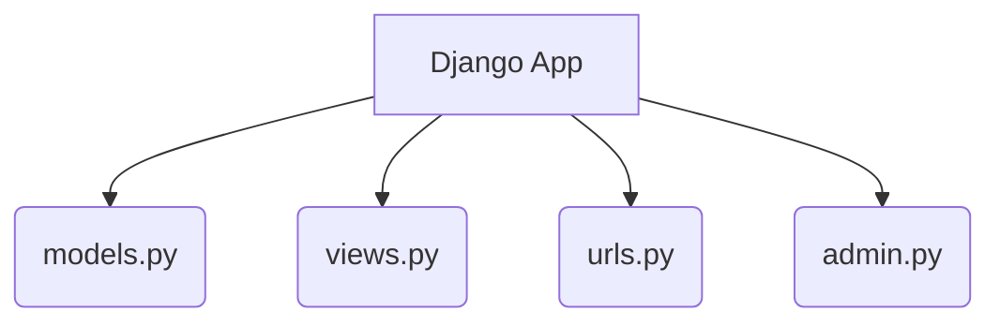

## Formal Definition

A Django App is a self-contained, modular Python package within a Django project that provides a specific set of features or domain logic, typically containing its own models, views, templates, and URLs.

## Explanation

Apps are the building blocks of a Django project. If you are building an e-commerce site, you might have one app for users, one app for products, and one app for billing. This modularity makes code easier to maintain and reuse.

## How It Works

1. Created using `python manage.py startapp <appname>`.
2. Generates a directory with `models.py`, `views.py`, `admin.py`, and `apps.py`.
3. The app must be registered in the project's `settings.py` under `INSTALLED_APPS`.
4. Its URLs are usually included in the project's root `urls.py`.

## Visual Explanation



## Mental Model & Analogy

If a Django Project is a company, a Django App is a specific department (e.g., HR, Accounting, Sales). Each department has its own specific job, its own files, and its own processes, but they all work together under the company.

## Implementation & Examples

```bash
python manage.py startapp users
```

Registering in `settings.py`:
```python
INSTALLED_APPS = [
    # ...
    'users',
]
```

## Key Properties

- Modular and reusable.
- Contains domain-specific logic.
- Has its own models and views.

## Connections

- **Built from:** [[django-project|Django Project]] — lives inside a project.
- **Builds into:** [[django-model|Django Model]] — apps define models.
- **Builds into:** [[django-view|Django View]] — apps define views.
- **Contrasts with:** [[django-project|Django Project]] — app is specific, project is global.

## Edge Cases & Gotchas

- If an app is not added to `INSTALLED_APPS`, Django will not recognize its models or templates.

## Active Recall Questions

> [!question]- How do you let the Django project know about a newly created app?
> By adding it to the `INSTALLED_APPS` list in `settings.py`.

## Sources

- [[django-summary|Source: Django Learning Roadmap]] — app creation and registration
