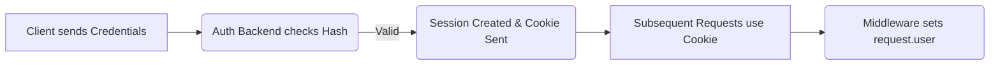

## Formal Definition

The Django Authentication System is a comprehensive, built-in framework that handles user accounts, groups, permissions, cookie-based sessions, and secure password hashing.

## Explanation

Building a secure login system is incredibly complex and risky. Django provides a robust, heavily audited system out of the box. It manages who is logged in (authentication) and what they are allowed to do (authorization).

## How It Works

1. Enabled by default via `django.contrib.auth` and `django.contrib.sessions`.
2. Provides a base `User` model containing username, email, password (hashed), and permission flags.
3. Middleware checks the session cookie on incoming requests and attaches the `User` object to `request.user`.
4. Views can use decorators like `@login_required` to restrict access.
5. Passwords are never stored in plain text; they are hashed using algorithms like PBKDF2.

## Visual Explanation



## Mental Model & Analogy

Authentication is the security guard checking your ID at the front door to verify you are who you say you are. Authorization (Permissions) is the access badge that determines which specific rooms in the building you are allowed to enter.

## Implementation & Examples

```python
from django.contrib.auth.decorators import login_required
from django.shortcuts import render

@login_required
def secret_page(request):
    return render(request, 'secret.html')
```

## Key Properties

- Pluggable: You can define a Custom User Model (highly recommended at the start of a project).
- Secure: Handles session hijacking prevention, password hashing, and CSRF protection.
- Includes Groups and Permissions for granular access control.

## Connections

- **Built from:** [[django-web-framework|Django Web Framework]] — built-in security layer.
- **Related:** [[django-admin-panel|Django Admin Panel]] — relies heavily on the auth system.
- **Related:** [[django-model|Django Model]] — User is a model.
- **Related:** [[django-request-response-lifecycle|Django Request-Response Lifecycle]] — sessions are handled in middleware.

## Edge Cases & Gotchas

- It is extremely difficult to switch to a Custom User Model mid-project. It is best practice to configure a Custom User Model in `settings.py` before running the very first migration.