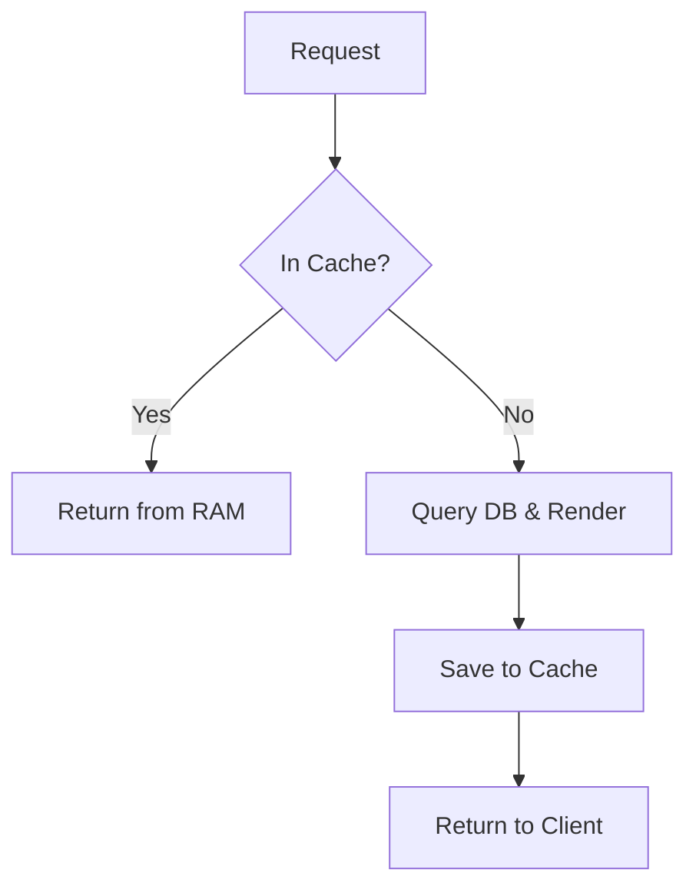
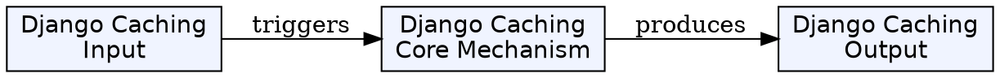
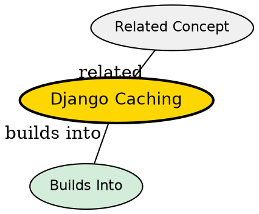

## Formal Definition

Django Caching is a system that stores the results of expensive computational operations or database queries in a fast-access storage medium (like RAM via Redis or Memcached) so that subsequent requests can retrieve the data without repeating the heavy processing.

## Explanation

Web servers spend most of their time querying databases or rendering templates. If a page's content doesn't change often (like a blog's homepage), there is no need to query the database and render the HTML for every single visitor. Caching saves the finished HTML in memory, serving it instantly to the next visitor.

## How It Works

1. A request arrives for a resource.
2. Django checks the Cache Backend (e.g., Redis).
3. If data is found (Cache Hit), it is returned immediately.
4. If not found (Cache Miss), Django executes the view, queries the database, and renders the result.
5. Django stores the result in the cache with a time-to-live (TTL).
6. Django returns the response to the client.

## Visual Explanation



## Mental Model & Analogy

Caching is like memorizing the answer to a complex math problem. The first time someone asks, you have to work it out on paper (Cache Miss). But for the next 10 minutes, if someone asks the same question, you just give them the answer from memory (Cache Hit).

## Implementation & Examples

```python
from django.views.decorators.cache import cache_page
from django.shortcuts import render

# Cache this view for 15 minutes
@cache_page(60 * 15)
def homepage(request):
    return render(request, 'home.html')
```

## Key Properties

- Supports multiple backends (Redis, Memcached, File-based, Database).
- Can cache entire views, specific template fragments, or arbitrary Python objects (Low-level API).
- Requires invalidation strategies to prevent serving stale data.


## Visual Explanation



## Semantic Network


## Connections

- **Built from:** [[django-web-framework|Django Web Framework]] -- performance optimization layer.
- **Related:** [[django-view|Django View]] -- often applied via view decorators.

## Edge Cases & Gotchas

- Caching dynamic, user-specific data (like a shopping cart) globally will cause users to see other users' data.
- "Cache Invalidation is one of the two hard things in computer science." Knowing when to delete cache is harder than setting it.