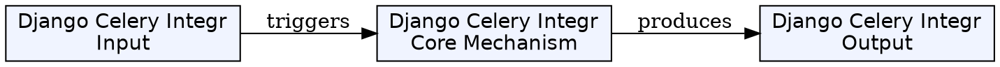
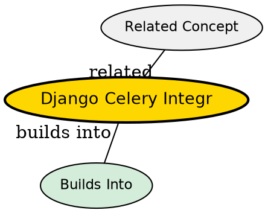

## Formal Definition

Django Celery Integration incorporates the Celery distributed task queue into a Django application to offload time-consuming, synchronous tasks to asynchronous background worker processes.

## Explanation

If a user uploads a video, processing that video takes 5 minutes. If Django does this in the view, the user's browser spins for 5 minutes waiting for a response. Celery allows the view to instantly say "Video received!", and hands the actual processing task to a separate worker program in the background.

## How It Works

1. A message broker (like Redis or RabbitMQ) is set up.
2. A task is defined in Django using the `@shared_task` decorator.
3. The view calls `task_name.delay(args)`.
4. Django pushes a message onto the broker queue.
5. A separate Celery worker process (running independently of the web server) picks up the message from the queue and executes the Python function.

## Visual Explanation

```mermaid
graph LR
  A[Django View] -->|task.delay()| B(Message Broker: Redis)
  B --> C(Celery Worker Process)
  C --> D[(Database)]
  A --> E[Immediate HTTP Response]
```

## Mental Model & Analogy

Celery is like a restaurant kitchen. The waiter (Django View) takes the order and gives it to the kitchen counter (Message Broker), and immediately returns to the customer (HTTP Response). The chefs in the back (Celery Workers) pick up the orders and do the heavy lifting of cooking the food asynchronously.

## Implementation & Examples

```python
from celery import shared_task

@shared_task
def send_bulk_emails():
    # Long running process
    pass

# In views.py
def register_user(request):
    # trigger async task
    send_bulk_emails.delay() 
    return HttpResponse("Registered!")
```

## Key Properties

- Requires a Message Broker (Redis/RabbitMQ).
- Tasks run in isolated processes, separate from the WSGI server.
- Prevents HTTP timeouts for long-running operations.


## Visual Explanation



## Semantic Network


## Connections

- **Built from:** [[python-programming-language|Python]] -- Celery is a Python task queue.
- **Related:** [[django-view|Django View]] -- views trigger celery tasks.
- **Contrasts with:** [[django-signals|Django Signals]] -- signals are synchronous, Celery is asynchronous.

## Edge Cases & Gotchas

- Passing Django ORM objects (like a user instance) to a Celery task is dangerous because the object might change in the DB before the task runs. Always pass the primary key (`user_id`) instead, and let the task fetch the fresh object from the DB.