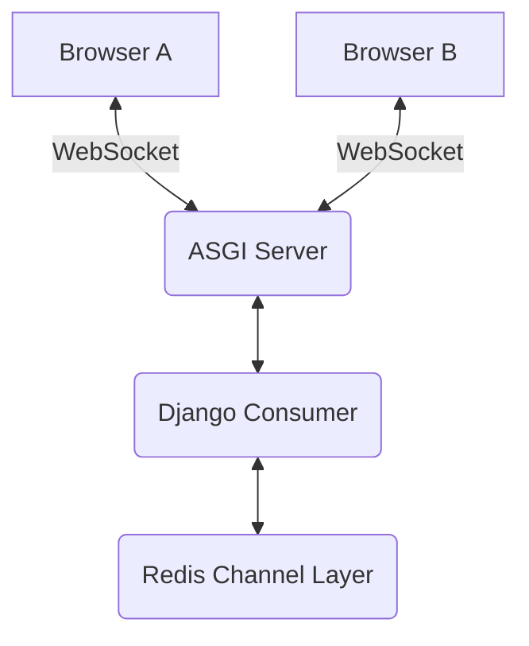

## Formal Definition

Django Channels is a project that extends Django to handle asynchronous protocols like WebSockets, allowing for bi-directional, real-time communication between the server and clients alongside traditional synchronous HTTP.

## Explanation

Standard Django operates on a request-response cycle: the browser asks, the server answers, and the connection closes. For chat apps or live notifications, the server needs to push data to the browser without being asked. Channels replaces Django's standard WSGI synchronous core with ASGI, enabling long-lived WebSocket connections.

## How It Works

1. Django is configured to run under an ASGI server (like Daphne or Uvicorn).
2. The `routing.py` file is created to route WebSocket connections (similar to `urls.py`).
3. **Consumers** are defined (similar to Views) to handle connecting, receiving messages, and disconnecting.
4. A **Channel Layer** (usually backed by Redis) is used to pass messages between different consumer instances, enabling broadcasting (e.g., sending a chat message to everyone in a room).

## Visual Explanation



## Mental Model & Analogy

Traditional HTTP is like sending a physical letter: you write it, send it, and wait days for a reply. Django Channels with WebSockets is like a phone call: once the connection is established, both parties can talk and listen continuously in real-time until they hang up.

## Implementation & Examples

```python
# consumers.py
from channels.generic.websocket import WebsocketConsumer
import json

class ChatConsumer(WebsocketConsumer):
    def connect(self):
        self.accept()

    def receive(self, text_data):
        self.send(text_data=json.dumps({'message': 'Message received!'}))
```

## Key Properties

- Relies on ASGI (Asynchronous Server Gateway Interface).
- Uses Consumers instead of Views.
- Requires a backing store like Redis for cross-process communication (Channel Layers).

## Connections

- **Built from:** [[django-web-framework|Django Web Framework]] — an official extension.
- **Contrasts with:** [[django-request-response-lifecycle|Django Request-Response Lifecycle]] — breaks the synchronous cycle in favor of persistent connections.
- **Related:** [[django-view|Django View]] — Consumers are the async, WebSocket equivalent of Views.

## Edge Cases & Gotchas

- Adds significant architectural complexity; deploying ASGI servers with Redis is much harder than a standard WSGI app.
- Mixing synchronous ORM calls inside asynchronous consumers can block the event loop and crash the server if not wrapped with `database_sync_to_async`.