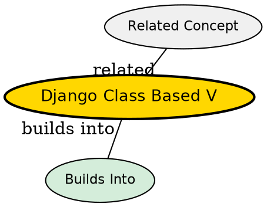

## Formal Definition

Django Class-Based Views (CBVs) are an object-oriented approach to writing views, allowing developers to structure view logic as classes rather than functions, promoting code reuse through inheritance and mixins.

## Explanation

Function-Based Views (FBVs) are great, but for standard operations (like showing a list of items, or displaying a form to create an item), they result in a lot of boilerplate code. CBVs provide pre-built classes (like `ListView`, `CreateView`) that already contain the logic for these common patterns.

## How It Works

1. Developer creates a class inheriting from a Django generic view (e.g., `ListView`).
2. Developer overrides class attributes (like `model` or `template_name`) or methods (like `get_queryset()`).
3. In `urls.py`, the class is routed using the `.as_view()` method.
4. When a request hits, `.as_view()` instantiates the class and dispatches the request to the appropriate HTTP method handler (`get()`, `post()`).

## Visual Explanation

```mermaid
graph TD
  A[URL Route] -->|as_view()| B(Dispatch Method)
  B -->|GET Request| C(get() method)
  B -->|POST Request| D(post() method)
```

## Mental Model & Analogy

Function-Based Views are like building a custom piece of furniture from raw wood every time. Class-Based Views are like buying IKEA furniture; the basic structure is already built, you just configure the specific pieces, but you can also swap out a leg or paint it if you need customization (overriding methods).

## Implementation & Examples

```python
from django.views.generic import ListView
from .models import Article

class ArticleListView(ListView):
    model = Article
    template_name = 'articles/list.html'
    context_object_name = 'articles'
```

## Key Properties

- Highly reusable via Mixins (e.g., `LoginRequiredMixin`).
- Standardizes CRUD operations.
- Can be harder to read initially due to hidden inherited logic.


## Visual Explanation


## Semantic Network


## Connections

- **Built from:** [[django-view|Django View]] -- an evolution of the view concept.
- **Related:** [[django-model|Django Model]] -- Generic CBVs are heavily tied to models.
- **Related:** [[django-url-dispatcher|Django URL Dispatcher]] -- called using `.as_view()`.
- **Related:** [[django-web-framework|Django Web Framework]] -- OOP patterns.

## Edge Cases & Gotchas

- Method resolution order (MRO) in complex multi-inheritance CBVs can make debugging difficult.
- FBVs are often better for complex, non-standard business logic where CBVs would require overriding too many methods.