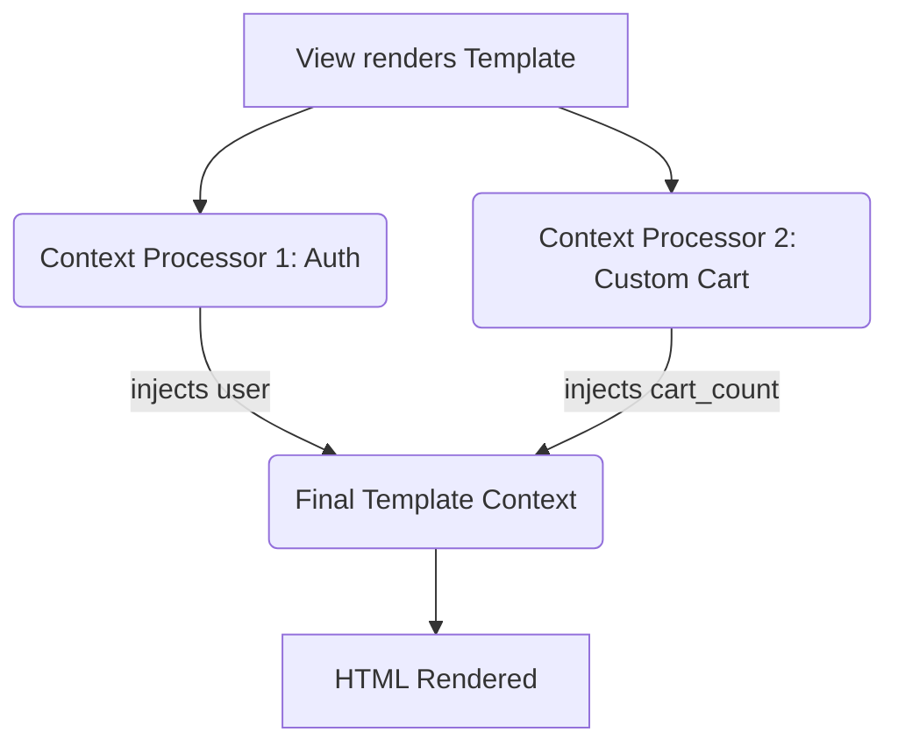
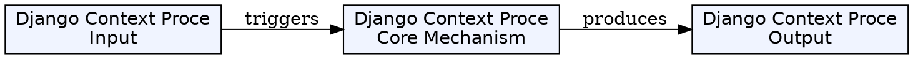
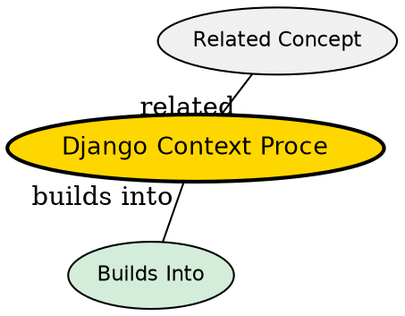

## Formal Definition

A Django Context Processor is a Python function that takes an `HttpRequest` object and returns a dictionary of variables to be automatically merged into the template context across all templates rendered in the project.

## Explanation

Imagine you want to display the user's shopping cart item count in the navbar of every single page on your site. Passing `cart_count` from every single view would violate DRY (Don't Repeat Yourself). A context processor runs automatically before template rendering and injects that variable globally.

## How It Works

1. A python function is defined that accepts `request`.
2. The function returns a dictionary `{'cart_count': 5}`.
3. The string path to this function is added to `OPTIONS['context_processors']` inside the `TEMPLATES` setting.
4. When `render()` is called in any view, Django runs the processor and adds the dictionary to the template context.

## Visual Explanation



## Mental Model & Analogy

A Context Processor is like a global sponsor for an event. The specific speakers (Views) bring their own specific topics (context variables), but the global sponsor (Context Processor) automatically hands out a swag bag (global variables) to every attendee (Template) regardless of which speaker they are watching.

## Implementation & Examples

```python
# context_processors.py
def site_name(request):
    return {'SITE_NAME': 'My Awesome Website'}

# settings.py
TEMPLATES = [
    {
        # ...
        'OPTIONS': {
            'context_processors': [
                # ...
                'myapp.context_processors.site_name',
            ],
        },
    },
]
```

## Key Properties

- Runs globally for every template rendered with `RequestContext` (which `render()` uses).
- Useful for navbars, footers, and global settings.
- Can impact performance if it queries the database heavily on every page load.


## Visual Explanation



## Semantic Network


## Connections

- **Built from:** [[django-template-engine|Django Template Engine]] -- ties into the rendering pipeline.
- **Related:** [[django-view|Django View]] -- augments the data provided by the view.

## Edge Cases & Gotchas

- Since context processors run on *every* template render, putting a slow database query inside one will globally degrade the performance of the entire application.