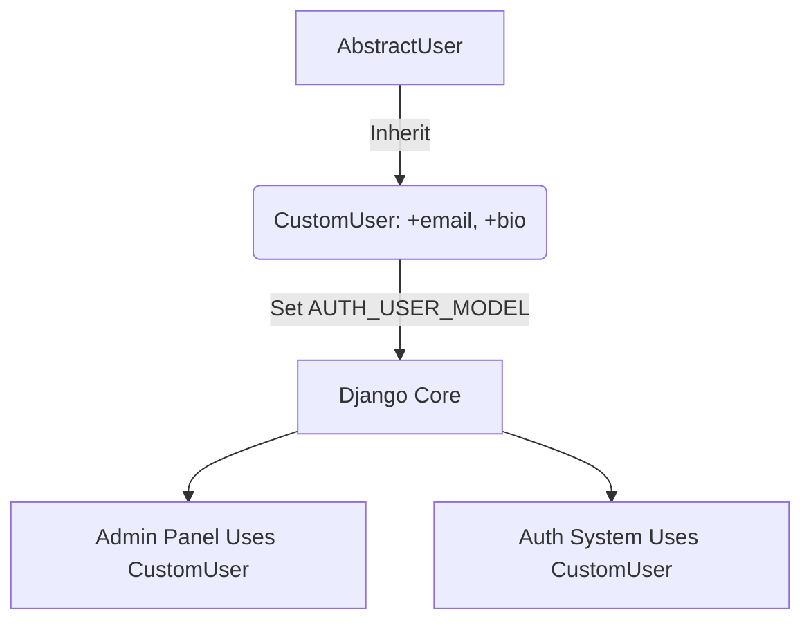
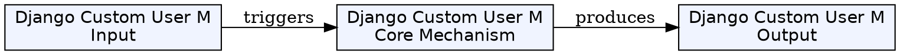
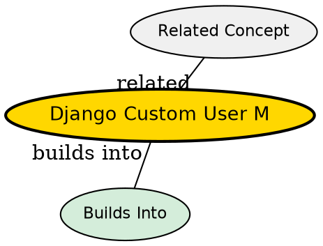

## Formal Definition

A Django Custom User Model is a developer-defined substitute for Django's default `User` class, allowing the extension or modification of core authentication fields and behaviors (e.g., using an email address instead of a username for login).

## Explanation

Django comes with a great User model, but it forces you to have a `username` field. If you want users to log in with an email address, or if you want to add a `company_name` field directly to the user table, you need to replace the default model with a custom one.

## How It Works

1. Create a model that inherits from `AbstractUser` or `AbstractBaseUser`.
2. Add custom fields (e.g., `bio`, `phone_number`).
3. Set `AUTH_USER_MODEL = 'myapp.CustomUser'` in `settings.py`.
4. Create the initial migrations.
5. All Django internals (Admin, Auth, Forms) will now use your custom model instead of the default.

## Visual Explanation



## Mental Model & Analogy

It's like replacing the engine of a car. Django provides a V6 engine (Default User). But before you start driving (running migrations), you swap it out for a V8 engine (Custom User). As long as you tell the car's computer about the swap (`AUTH_USER_MODEL`), the rest of the car drives normally but with the new engine's capabilities.

## Implementation & Examples

```python
from django.contrib.auth.models import AbstractUser
from django.db import models

class CustomUser(AbstractUser):
    # AbstractUser already has email, password, etc.
    phone_number = models.CharField(max_length=15)
    
    # Example: Make email unique
    email = models.EmailField(unique=True)
```

## Key Properties

- Must be configured *before* running the first `migrate` command.
- `AbstractUser` keeps standard fields; `AbstractBaseUser` provides a blank slate with only password and last_login.


## Visual Explanation



## Semantic Network


## Connections

- **Built from:** [[django-authentication-system|Django Authentication System]] -- overrides its core component.
- **Related:** [[django-model|Django Model]] -- it is simply a specialized model.

## Edge Cases & Gotchas

- Attempting to switch to a Custom User Model in the middle of a project with an existing database is extraordinarily difficult and involves complex manual database surgery.
- Best practice: Always start a new Django project with a Custom User Model, even if you don't add fields to it immediately.