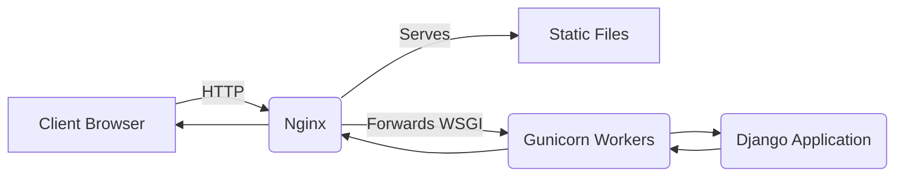

## Formal Definition

Django Deployment with WSGI involves transitioning a Django application from a local development server to a production environment using a production-grade Web Server Gateway Interface (WSGI) HTTP Server (like Gunicorn) sitting behind a reverse proxy (like Nginx).

## Explanation

The `python manage.py runserver` command is explicitly not secure or scalable enough for real users on the internet. In production, you need a heavy-duty server like Nginx to handle internet traffic and static files, which passes dynamic requests to an application server like Gunicorn, which finally translates them for Django.

## How It Works

1. Internet requests hit **Nginx** (Reverse Proxy).
2. Nginx checks if the request is for a static file (CSS/JS). If yes, it returns it immediately.
3. If not, Nginx forwards the request to **Gunicorn** via a socket.
4. Gunicorn translates the raw HTTP into Python objects based on the WSGI specification.
5. Gunicorn passes the request to Django's `wsgi.py` entry point.
6. Django processes the request and sends the response back down the chain.

## Visual Explanation



## Mental Model & Analogy

Nginx is the front-desk receptionist of a huge corporate building. When you ask for a brochure (static file), the receptionist hands it to you immediately. When you ask to speak to the CEO, the receptionist forwards you to the CEO's executive assistant (Gunicorn), who translates your request into the exact format the CEO (Django) prefers to handle.

## Implementation & Examples

```bash
# Starting gunicorn for a project named 'myproject'
gunicorn myproject.wsgi:application --bind 0.0.0.0:8000 --workers 3
```

## Key Properties

- Separation of concerns: Nginx handles network security/assets, Gunicorn handles process management, Django handles business logic.
- Horizontally scalable: Gunicorn can spin up multiple worker processes to handle concurrent requests.

## Connections

- **Built from:** [[django-web-framework|Django Web Framework]] — production architectural pattern.
- **Related:** [[django-project|Django Project]] — contains the `wsgi.py` file.
- **Related:** [[django-static-files|Django Static Files]] — Nginx takes over static file serving.

## Edge Cases & Gotchas

- A missing or misconfigured `ALLOWED_HOSTS` setting in production will cause Django to block all incoming requests and return 400 Bad Request errors.

## Active Recall Questions

> [!question]- Why do we use Nginx in front of Gunicorn in production?
> Because Nginx is highly optimized for buffering requests, handling SSL, and serving static files directly, protecting Gunicorn from slow clients.

## Sources

- [[django-summary|Source: Django Learning Roadmap]] — deployment, Gunicorn, Nginx
