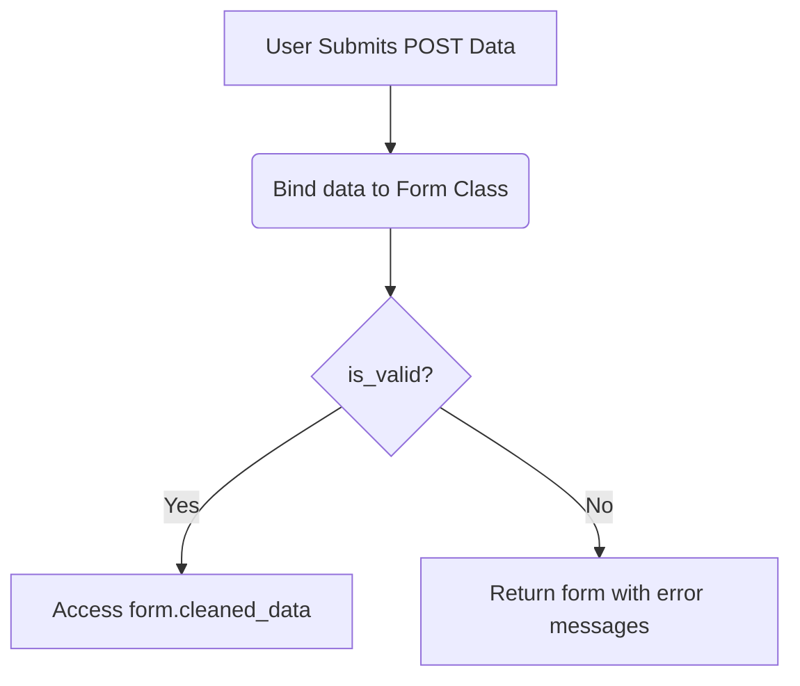

## Formal Definition

A Django Form is a Python class that manages the rendering of HTML forms, parsing of submitted data, and rigorous validation of user input before it is processed by the backend.

## Explanation

Handling user input securely is hard. You have to write HTML, check if fields are empty, check if emails are valid, and sanitize data to prevent attacks. Django Forms automate all of this. You define the form in Python, and Django generates the HTML and handles the validation logic.

## How It Works

1. Developer defines a `forms.Form` or `forms.ModelForm` class.
2. The view instantiates the form and passes it to the template for rendering.
3. Upon POST request, the view binds the submitted data to the form (`form = MyForm(request.POST)`).
4. The view calls `form.is_valid()`.
5. Django runs all defined validators (e.g., checking email format, max length).
6. If valid, data is available in `form.cleaned_data`. If invalid, errors are attached to the form for the template to display.

## Visual Explanation



## Mental Model & Analogy

A Django Form is like a strict bouncer at an exclusive club. Before anyone (data) gets in, the bouncer checks their ID, checks the guest list, and ensures they meet the dress code (validation). If they fail, they are turned away with a reason. If they pass, they are let in safely.

## Implementation & Examples

```python
from django import forms

class ContactForm(forms.Form):
    subject = forms.CharField(max_length=100)
    message = forms.CharField(widget=forms.Textarea)
    sender = forms.EmailField()
```

## Key Properties

- `ModelForms` automatically generate fields based on a Django Model.
- Handles HTML rendering (`as_p`, `as_table`).
- Clean methods allow for custom, complex cross-field validation.

## Connections

- **Built from:** [[django-web-framework|Django Web Framework]] — data handling utility.
- **Related:** [[django-model|Django Model]] — ModelForms map directly to Models.
- **Related:** [[django-view|Django View]] — views manage the form lifecycle.
- **Related:** [[django-template-engine|Django Template Engine]] — renders the form.

## Edge Cases & Gotchas

- Never trust `request.POST` data directly; always access validated data via `form.cleaned_data`.

## Active Recall Questions

> [!question]- What method must be called on a bound form to trigger validation?
> `is_valid()`

## Sources

- [[django-summary|Source: Django Learning Roadmap]] — HTML forms, validation, clean methods
