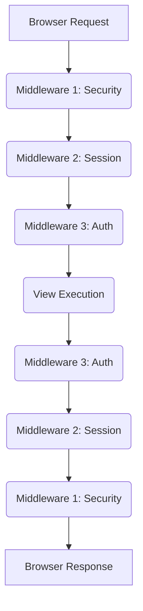

## Formal Definition

Django Middleware is a framework of hooks into Django's request/response processing. It's a light, low-level "plugin" system for globally altering Django's input or output.

## Explanation

Middleware acts like a series of checkpoints that every HTTP request must pass through before it reaches your view, and every response must pass through before it reaches the browser. It is used for cross-cutting concerns like handling sessions, enforcing CSRF protection, authentication, or logging.

## How It Works

1. A request enters Django.
2. It passes down through the `process_request` methods of each middleware class listed in `settings.MIDDLEWARE` (top to bottom).
3. The URL router and View are executed.
4. The resulting response passes back up through the `process_response` methods of each middleware (bottom to top).
5. The response is sent to the client.

## Visual Explanation



## Mental Model & Analogy

Think of Middleware as airport security and customs. When you arrive (request), you must pass through passport control, security screening, and bag check in a specific order before you reach your gate (the View). When you leave (response), you pass through a different set of checkpoints in reverse order.

## Implementation & Examples

```python
# settings.py
MIDDLEWARE = [
    'django.middleware.security.SecurityMiddleware',
    'django.contrib.sessions.middleware.SessionMiddleware',
    'django.middleware.common.CommonMiddleware',
    'django.middleware.csrf.CsrfViewMiddleware',
    'django.contrib.auth.middleware.AuthenticationMiddleware',
]
```

## Key Properties

- Global: Applies to all requests.
- Ordered: The sequence in the settings array matters heavily.
- Can short-circuit: Middleware can return a response directly without calling the view.

## Connections

- **Built from:** [[django-web-framework|Django Web Framework]] — hooks into the core framework.
- **Related:** [[django-request-response-lifecycle|Django Request-Response Lifecycle]] — forms the boundary layers of the lifecycle.
- **Related:** [[django-authentication-system|Django Authentication System]] — auth relies on middleware to set `request.user`.

## Edge Cases & Gotchas

- Slow middleware slows down every single request in the application.
- Incorrect ordering (e.g., placing Auth before Sessions) will break the application.

## Active Recall Questions

> [!question]- In what order are middleware evaluated for responses?
> Bottom-to-top (reverse order of the `MIDDLEWARE` setting list).

## Sources

- [[django-summary|Source: Django Learning Roadmap]] — advanced django, request processing
