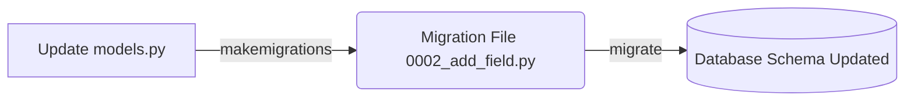

## Formal Definition

Django Migrations are a version control system for a database schema. They represent a set of operations (written in Python) that transition the database from one state to another, keeping it synchronized with the Django Models.

## Explanation

When you change a Model (e.g., add a new column), the database doesn't know about it automatically. Migrations are instructions that tell the database exactly how to alter its tables to match your new Python code.

## How It Works

1. Developer changes `models.py`.
2. Developer runs `python manage.py makemigrations`.
3. Django compares the models to the previous state and generates a migration file (Python script).
4. Developer runs `python manage.py migrate`.
5. Django translates the migration file into SQL `ALTER TABLE` / `CREATE TABLE` statements and executes them.
6. Django records that this migration was applied in the `django_migrations` table.

## Visual Explanation



## Mental Model & Analogy

Migrations are like architectural blueprints showing modifications to a building. If you want to add a room, you don't just magically have a room. You draw up the plans (makemigrations) and then the construction crew follows the plans to build it (migrate).

## Implementation & Examples

```bash
# Generate the migration files
python manage.py makemigrations

# Apply the changes to the database
python manage.py migrate
```

## Key Properties

- Auto-generated based on model differences.
- Can be applied forward or rolled backward.
- Tracked in a special database table to prevent applying the same migration twice.

## Connections

- **Built from:** [[django-model|Django Model]] — migrations reflect model changes.
- **Related:** [[django-orm|Django ORM]] — works closely with the ORM.
- **Related:** [[django-project|Django Project]] — managed via manage.py.
- **Related:** [[python-programming-language|Python]] — migrations are just Python files.

## Edge Cases & Gotchas

- Deleting migration files manually can cause the database state and Django state to fall out of sync, requiring complex manual fixes.
- Adding a non-nullable field to an existing table requires providing a default value.

## Active Recall Questions

> [!question]- What is the difference between makemigrations and migrate?
> `makemigrations` creates the instruction file based on model changes, while `migrate` actually executes those instructions on the database.

## Sources

- [[django-summary|Source: Django Learning Roadmap]] — database module, makemigrations, migrate
