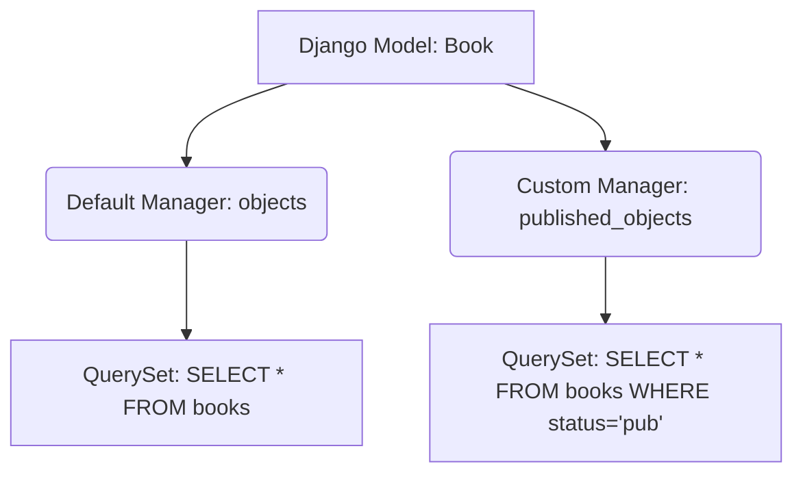

## Formal Definition

A Django Model Manager is the interface through which database query operations are provided to Django models. It is the component responsible for generating QuerySets.

## Explanation

Every time you type `User.objects.all()`, `objects` is the default Manager. A Manager acts as the gateway to the database for a specific class. By writing custom managers, you can encapsulate common database queries directly on the model level rather than repeating them in your views.

## How It Works

1. A model inherits a default manager named `objects` from `models.Manager`.
2. Developers can subclass `models.Manager` and add custom methods.
3. The custom manager is instantiated inside the Model class.
4. Views call methods on the manager (e.g., `Book.published_books.all()`).

## Visual Explanation



## Mental Model & Analogy

If a Model is a warehouse of goods, the Manager is the warehouse foreman. You don't go into the warehouse yourself. You ask the foreman: "Get me all items" (objects.all()) or "Get me only the items that are damaged" (custom manager).

## Implementation & Examples

```python
from django.db import models

class PublishedManager(models.Manager):
    def get_queryset(self):
        return super().get_queryset().filter(status='published')

class Post(models.Model):
    title = models.CharField(max_length=100)
    status = models.CharField(max_length=20)
    
    objects = models.Manager() # Default
    published = PublishedManager() # Custom
```

## Key Properties

- Encapsulates "table-level" operations (querying many rows).
- Keeps views thin by moving complex ORM filters to the model layer.
- A model can have multiple managers.

## Connections

- **Built from:** [[django-orm|Django ORM]] — an extension point of the ORM.
- **Related:** [[django-model|Django Model]] — attached to models.
- **Related:** [[django-query-optimization|Django Query Optimization]] — custom managers are great places to put `select_related`.

## Edge Cases & Gotchas

- If you override the default `objects` manager, Django's admin panel might filter out data you wanted to see. It is often safer to add a secondary custom manager.

## Active Recall Questions

> [!question]- What is the name of the default manager provided by Django on all models?
> `objects`

## Sources

- [[django-summary|Source: Django Learning Roadmap]] — custom managers, ORM mastery
