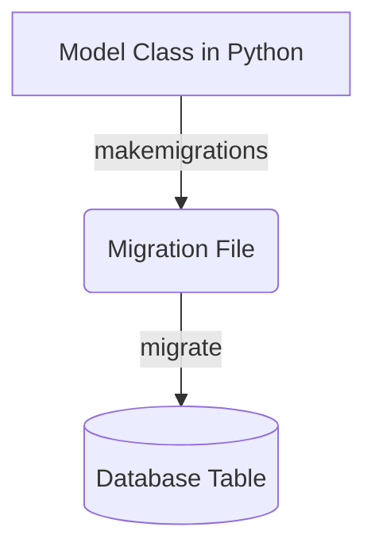

## Formal Definition

A Django Model is a Python class that defines the structure and behavior of data stored in the database, acting as the definitive source of information about your data using Django's Object-Relational Mapper (ORM).

## Explanation

Instead of writing raw SQL to create tables and manage data, you write Python classes. A Model represents a single database table, and its attributes represent the columns. Django automatically translates this class into the corresponding SQL.

## How It Works

1. Define a class inheriting from `django.db.models.Model`.
2. Define class attributes as fields (e.g., `models.CharField`).
3. Run `makemigrations` to generate migration files based on the model.
4. Run `migrate` to apply the changes to the database schema.
5. Use the model's Manager (e.g., `Model.objects`) to query the database.

## Visual Explanation



## Mental Model & Analogy

Think of a Model as a blueprint or a mold. If you want to make toy cars (database rows), you first design the mold (the Model) specifying it has 4 wheels, a color, and a shape. Django uses this mold to stamp out data in the database.

## Implementation & Examples

```python
from django.db import models

class Student(models.Model):
    name = models.CharField(max_length=100)
    age = models.IntegerField()
```

## Key Properties

- Subclasses `django.db.models.Model`.
- Fields map to database columns.
- Provides an automatic API to query the database.

## Connections

- **Built from:** [[django-orm|Django ORM]] — the system that powers models.
- **Builds into:** [[django-migration|Django Migration]] — models generate migrations.
- **Related:** [[django-view|Django View]] — views interact with models.
- **Related:** [[django-form|Django Form]] — ModelForms are generated from models.

## Edge Cases & Gotchas

- Changing a model requires making and applying migrations; the database doesn't magically update.
- N+1 query problems can occur if relationships are not queried efficiently using `select_related` or `prefetch_related`.