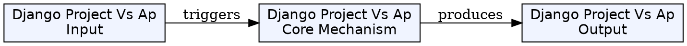
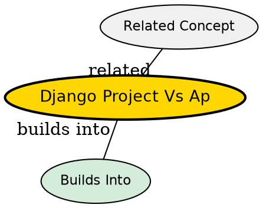

## What's Being Compared

In Django, the architectural structure is divided into two distinct concepts: the Project and the App. Understanding the boundary between these two is fundamental to writing maintainable, idiomatic Django code.

## Core Tension

The core tension is between **Global Configuration** and **Specific Feature Logic**. A project is a singular, overarching entity that configures an environment, whereas an app is a modular, reusable component that actually does the work.

## Comparison Table

| Dimension | [[django-project|Project]] | [[django-app|App]] |
|-----------|--------------|--------------|
| Scope | Global to the website | Specific to a feature/domain |
| Reusability | Cannot be reused | Highly reusable across projects |
| Contents | settings, root urls, wsgi | models, views, templates, tests |
| Creation Command | `startproject` | `startapp` |
| Analogy | The Company | A Department |

## When to Choose a Project

You only ever create one Project per website or backend service. It is the container. You interact with project-level files when configuring databases, installing third-party packages, or defining the root URL tree.

## When to Choose an App

You create an App every time you introduce a distinct domain of logic to your system. For example, if you add a blogging feature, you create a `blog` app. If you add a user payment system, you create a `payments` app.

## The Insight

Django Apps are designed to be plug-and-play. Theoretically, a well-written Django App (like a blogging app) could be taken from your current Django Project and dropped into a completely different Django Project, and it would work with minimal configuration. The Project's job is simply to wire these independent apps together.

## Visual Explanation

## Semantic Network

