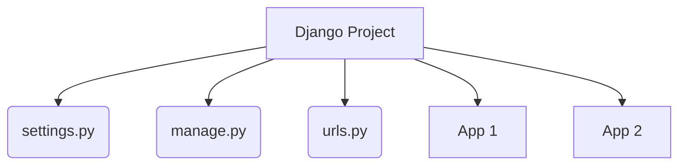
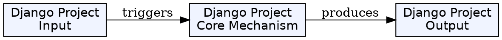
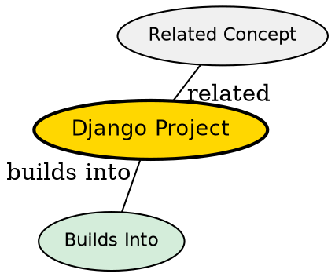

## Formal Definition

A Django Project is the entire application setup, encompassing a collection of settings, configurations, and apps that make up a single web site or web application.

## Explanation

The project is the outer shell of your application. It holds the global configurations, such as database connections, installed apps, middleware, and the root URL routing. A project does not usually contain business logic itself; instead, it delegates that to apps.

## How It Works

1. Created using `django-admin startproject <name>`.
2. Generates a directory containing `manage.py`.
3. Generates an inner configuration directory containing `settings.py`, `urls.py`, `wsgi.py`, and `asgi.py`.
4. Executes global commands via `manage.py`.

## Visual Explanation



## Mental Model & Analogy

A Django Project is like a company. The company has a headquarters (settings, global rules) and a directory (root URLs). The company itself doesn't do the specialized work; it hires different departments (Django Apps) to handle billing, user management, and core services.

## Implementation & Examples

```bash
django-admin startproject config .
```

## Key Properties

- Contains `settings.py` for global configuration.
- Contains `manage.py` for project-level commands.
- Orchestrates multiple apps.


## Visual Explanation



## Semantic Network


## Connections

- **Built from:** [[django-web-framework|Django Web Framework]] -- instantiated framework.
- **Builds into:** [[django-app|Django App]] -- projects contain apps.
- **Contrasts with:** [[django-app|Django App]] -- project is the container, app is the feature.
- **Related:** [[django-project-vs-app|Django Project vs App]] -- detailed synthesis.

## Edge Cases & Gotchas

- Hardcoding logic inside the project's root URLs or settings is considered bad practice; logic belongs in apps.